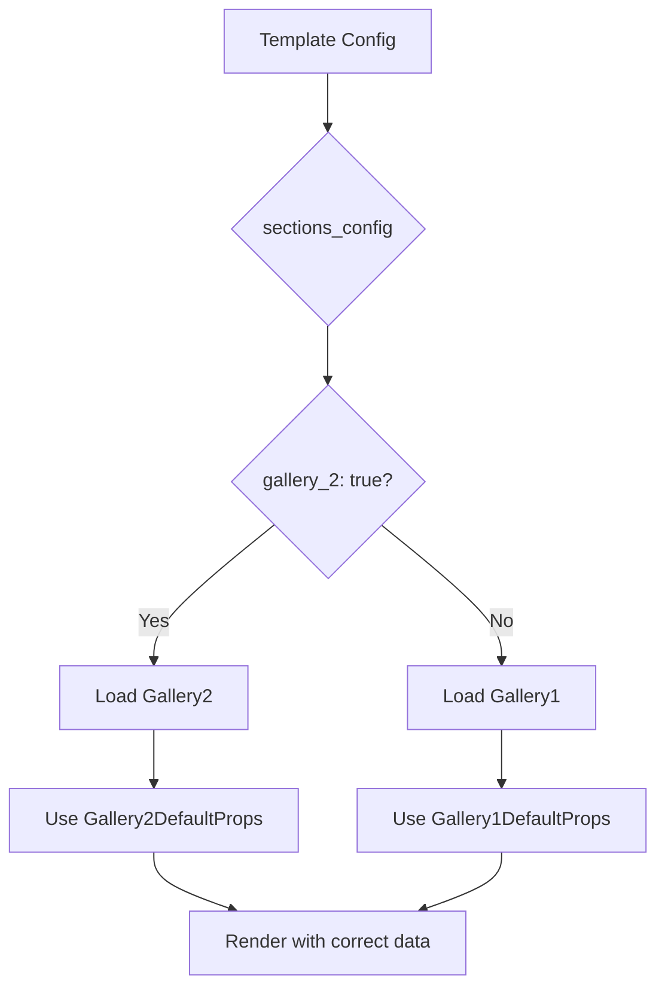

# 📋 GUÍA COMPLETA: Cómo Registrar Nuevas Secciones de Template

**Fecha:** 22 de Septiembre, 2025
**Propósito:** Documentar todas las ubicaciones donde se debe registrar una nueva sección para que funcione correctamente en el sistema

---

## 🎯 RESUMEN EJECUTIVO

Para que una nueva sección (como `Itinerary1`) funcione completamente en el sistema de templates, debe registrarse en **7 ubicaciones específicas**:

1. ✅ **Crear el componente** en la carpeta de secciones
2. ✅ **Configurar en customizer** (sectionFieldsMap)
3. ✅ **Integrar con hook** (useDynamicCustomizer)
4. ✅ **Validar en backend** (templates.py)
5. ✅ **Registrar en registry** (index.ts)
6. ✅ **Actualizar tipos TypeScript**
7. ✅ **Documentar cambios**

---

## 📁 UBICACIONES ESPECÍFICAS POR ARCHIVO

### 1. 🎨 **CREAR COMPONENTE DE SECCIÓN**

**Ubicación**: `frontend/src/components/templates/categories/[categoria]/sections/[nombre_seccion]/[Nombre]1.tsx`

**Ejemplo para Itinerary**:
```
frontend/src/components/templates/categories/weddings/sections/itinerary/Itinerary1.tsx
```

**Elementos Requeridos**:
- Interface de props
- Componente React funcional
- DefaultProps export
- Documentación JSDoc

**Ejemplo**:
```typescript
interface Itinerary1Props {
  title?: string;
  // ... otras props
}

export const Itinerary1: React.FC<Itinerary1Props> = ({
  title = 'Tu Itinerario'
}) => {
  // Implementación del componente
};

export const Itinerary1DefaultProps = {
  title: 'Tu Itinerario',
  // ... otros valores por defecto
};
```

---

### 2. ⚙️ **CONFIGURAR EN CUSTOMIZER**

**Ubicación**: `frontend/src/components/templates/categories/[categoria]/customizer/sectionFieldsMap.ts`

**Elementos a Agregar**:

#### A) Sección en WEDDING_SECTION_FIELDS_MAP:
```typescript
export const WEDDING_SECTION_FIELDS_MAP: Record<string, SectionConfig> = {
  // ... otras secciones

  itinerary: {
    label: 'Itinerario',
    icon: '📅',
    fields: [
      'itinerary_title',
      'itinerary_event_ceremonia_enabled',
      'itinerary_event_ceremonia_time',
      // ... otros campos
    ]
  },
};
```

#### B) Definiciones de Campos en FIELD_DEFINITIONS:
```typescript
export const FIELD_DEFINITIONS: Record<string, CustomizerField> = {
  // ... otros campos

  itinerary_title: {
    key: 'itinerary_title',
    label: 'Título del Itinerario',
    type: 'text',
    section: 'itinerary',
    category: 'Títulos'
  },

  itinerary_event_ceremonia_enabled: {
    key: 'itinerary_event_ceremonia_enabled',
    label: 'Mostrar Ceremonia',
    type: 'checkbox',
    section: 'itinerary',
    category: 'Eventos'
  },

  // ... más definiciones
};
```

---

### 3. 🔗 **INTEGRAR CON HOOK DE CUSTOMIZER**

**Ubicación**: `frontend/src/lib/hooks/useDynamicCustomizer.ts`

**Elementos a Agregar**:

#### A) Import de DefaultProps:
```typescript
import { Itinerary1DefaultProps } from '@/components/templates/categories/weddings/sections/itinerary/Itinerary1';
```

#### B) Casos en Switch Statement (useEffect):
```typescript
// Itinerary Section Defaults
case 'itinerary_title':
  defaultValue = templateProps.itinerary?.title || Itinerary1DefaultProps.title;
  break;
case 'itinerary_event_ceremonia_enabled':
  defaultValue = templateProps.itinerary?.event_ceremonia_enabled || Itinerary1DefaultProps.event_ceremonia_enabled;
  break;
// ... más casos
```

#### C) Sección en transformToTemplateProps:
```typescript
const transformToTemplateProps = useCallback((data: any) => {
  return {
    // ... otras secciones

    itinerary: {
      title: data.itinerary_title || Itinerary1DefaultProps.title,
      event_ceremonia_enabled: data.itinerary_event_ceremonia_enabled !== undefined ?
        data.itinerary_event_ceremonia_enabled : Itinerary1DefaultProps.event_ceremonia_enabled,
      // ... otros campos
    },
  };
}, []);
```

---

### 4. 🛡️ **VALIDAR EN BACKEND**

**Ubicación**: `backend/api/templates.py`

**Elemento a Modificar**:
```python
CATEGORY_SECTION_MAP = {
    'weddings': {
        'required': ['hero', 'welcome'],
        'optional': ['story', 'couple', 'video', 'gallery', 'countdown', 'itinerary', 'footer'],
        'forbidden': []
    },
    # ... otras categorías
}
```

**Ubicación**: Agregar 'itinerary' a la lista de secciones opcionales para la categoría correspondiente.

---

### 5. 📝 **REGISTRAR EN REGISTRY DE SECCIONES**

**Ubicación**: `frontend/src/components/templates/categories/[categoria]/sections/registry/index.ts`

**Elementos a Agregar**:

#### A) Import del Componente:
```typescript
// Import Wedding Itinerary Sections
import { Itinerary1 } from '../itinerary/Itinerary1';
```

#### B) Actualizar Interface WeddingSectionsByType:
```typescript
export interface WeddingSectionsByType {
  // ... otras secciones
  itinerary: { [key: string]: ComponentType<any> };
  footer: { [key: string]: ComponentType<any> };
}
```

#### C) Registrar en weddingSectionRegistry:
```typescript
export const weddingSectionRegistry: WeddingSectionRegistry = {
  // ... otras secciones

  // Itinerary Sections
  'itinerary_1': Itinerary1,

  // Footer Sections
  'footer_1': Footer1,
};
```

#### D) Agregar a weddingSectionsByType:
```typescript
export const weddingSectionsByType: WeddingSectionsByType = {
  // ... otras secciones

  itinerary: {
    'itinerary_1': Itinerary1,
    // 'itinerary_2': Itinerary2,
    // 'itinerary_3': Itinerary3,
  },

  footer: {
    'footer_1': Footer1,
  },
};
```

#### E) Actualizar WeddingTemplateConfig:
```typescript
export interface WeddingTemplateConfig {
  sections: {
    hero: string;
    welcome: string;
    couple: string;
    countdown: string;
    story: string;
    video: string;
    gallery: string;
    itinerary: string; // ✅ NUEVO
    footer: string;
  };
}
```

#### F) Actualizar Configuraciones de Ejemplo:
```typescript
export const exampleWeddingTemplateConfigs = {
  'elegante_romance': {
    sections: {
      hero: 'hero_1',
      welcome: 'welcome_1',
      couple: 'couple_1',
      countdown: 'countdown_1',
      story: 'story_1',
      video: 'video_1',
      gallery: 'gallery_1',
      itinerary: 'itinerary_1', // ✅ NUEVO
      footer: 'footer_1',
    }
  },
};
```

---

### 6. 📊 **ACTUALIZAR TIPOS TYPESCRIPT**

Las interfaces TypeScript se actualizan automáticamente al modificar los archivos anteriores, pero verificar:

- ✅ Props interface del componente
- ✅ WeddingSectionsByType interface
- ✅ WeddingTemplateConfig interface
- ✅ CustomizerField definitions

---

### 7. 📚 **DOCUMENTAR CAMBIOS**

**Archivos a Actualizar**:

#### A) ultima_modificacion.md:
- Fecha y descripción de cambios
- Lista de archivos modificados
- Funcionalidades implementadas
- URLs de testing

#### B) CLAUDE.md:
- Sección sobre la nueva funcionalidad
- Archivos afectados
- Características principales

#### C) README.md (opcional):
- Nuevas características en resumen ejecutivo

---

## ✅ CHECKLIST DE VERIFICACIÓN

### **Frontend Registration Checklist**:
- [ ] 1. Componente creado en `/sections/[nombre]/[Nombre]1.tsx`
- [ ] 2. Sección agregada a `WEDDING_SECTION_FIELDS_MAP`
- [ ] 3. Campos definidos en `FIELD_DEFINITIONS`
- [ ] 4. Import agregado en `useDynamicCustomizer.ts`
- [ ] 5. Casos agregados al switch statement
- [ ] 6. Sección agregada a `transformToTemplateProps`
- [ ] 7. Import agregado en `registry/index.ts`
- [ ] 8. Interface `WeddingSectionsByType` actualizada
- [ ] 9. Componente registrado en `weddingSectionRegistry`
- [ ] 10. Sección agregada a `weddingSectionsByType`
- [ ] 11. Interface `WeddingTemplateConfig` actualizada
- [ ] 12. Configuraciones de ejemplo actualizadas

### **Backend Validation Checklist**:
- [ ] 13. Sección agregada a `CATEGORY_SECTION_MAP` en `templates.py`

### **Documentation Checklist**:
- [ ] 14. Cambios documentados en `ultima_modificacion.md`
- [ ] 15. Información agregada a `CLAUDE.md`
- [ ] 16. Testing verificado

### **Testing Checklist**:
- [ ] 17. Componente se puede importar sin errores
- [ ] 18. Sección aparece en customizer
- [ ] 19. Campos son editables
- [ ] 20. Cambios se reflejan en preview
- [ ] 21. Validación backend funciona
- [ ] 22. Registry funciona correctamente

---

## 🚨 ERRORES COMUNES A EVITAR

### ❌ **Error 1: Olvidar el Registry**
- **Síntoma**: Sección no carga dinámicamente
- **Solución**: Verificar registro completo en `index.ts`

### ❌ **Error 2: Tipos TypeScript Inconsistentes**
- **Síntoma**: Errores de compilación
- **Solución**: Actualizar todas las interfaces

### ❌ **Error 3: Campos No Mapeados en Hook**
- **Síntoma**: Customizer no funciona
- **Solución**: Agregar casos al switch statement

### ❌ **Error 4: Validación Backend Faltante**
- **Síntoma**: Errores al guardar templates
- **Solución**: Agregar sección a `CATEGORY_SECTION_MAP`

### ❌ **Error 5: Props por Defecto Incorrectos**
- **Síntoma**: Componente no renderiza correctamente
- **Solución**: Verificar `DefaultProps` y `transformToTemplateProps`

---

## 🏁 RESULTADO FINAL

Siguiendo esta guía completa, cualquier nueva sección quedará:

✅ **Completamente funcional** en el sistema
✅ **Dinámicamente cargable** por el registry
✅ **Editable** en el customizer
✅ **Validada** por el backend
✅ **Documentada** para futuros desarrolladores
✅ **Integrada** con el sistema de types

---

## 📋 EJEMPLO COMPLETO: CASO ITINERARY

La sección Itinerary se implementó siguiendo exactamente estos pasos:

1. ✅ **Componente**: `Itinerary1.tsx` con timeline de eventos
2. ✅ **Customizer**: 11 campos (título + 5 eventos × 2 campos)
3. ✅ **Hook**: Integración completa con `useDynamicCustomizer`
4. ✅ **Backend**: Validación en categoría 'weddings'
5. ✅ **Registry**: Registro completo en `index.ts`
6. ✅ **Types**: Interfaces actualizadas
7. ✅ **Docs**: Documentación completa

**Resultado**: Nueva sección completamente operativa y lista para producción.

---

# 🔄 SECCIÓN ADICIONAL: Registro de Variantes de Secciones

**Actualizado:** 22 de Septiembre, 2025
**Nuevo Patrón:** Implementación de Variantes (Gallery1 vs Gallery2)

## 🎯 ¿QUÉ SON LAS VARIANTES DE SECCIONES?

Las **variantes de secciones** permiten tener múltiples versiones de una misma sección (ej: `gallery_1`, `gallery_2`) que:
- **Comparten los mismos campos** del customizer (evita duplicación)
- **Tienen diferentes presentaciones** visuales
- **Se detectan automáticamente** por el sistema
- **Son intercambiables** sin pérdida de datos

### **Ejemplo Implementado: Gallery1 vs Gallery2**
- **Gallery1**: Filtros por categorías, layout masonry
- **Gallery2**: Sin filtros, layout simple y responsive
- **Mismos datos**: Ambas usan las mismas 8 imágenes y campos
- **Diferente UX**: Presentación totalmente distinta

---

## 📋 PASOS ADICIONALES PARA VARIANTES

### **1. CREAR LA NUEVA VARIANTE**

Seguir los mismos pasos 1-7 de la guía principal, pero:

#### **Naming Convention:**
- **Primera variante**: `SectionName1.tsx` (ej: `Gallery1.tsx`)
- **Nueva variante**: `SectionName2.tsx` (ej: `Gallery2.tsx`)
- **Registry keys**: `section_1`, `section_2` (ej: `gallery_1`, `gallery_2`)

#### **Props Compatibility:**
```typescript
// ✅ CORRECTO: Mismas props, diferente presentación
interface Gallery1Props {
  sectionSubtitle?: string;
  sectionTitle?: string;
  galleryImages?: GalleryImage[];
}

interface Gallery2Props {
  sectionSubtitle?: string;     // ✅ Mismo nombre
  sectionTitle?: string;        // ✅ Mismo nombre
  galleryImages?: GalleryImage[]; // ✅ Misma estructura
}
```

#### **Registry Registration:**
```typescript
// En registry/index.ts
export const weddingSectionRegistry: WeddingSectionRegistry = {
  // Variantes de Gallery
  'gallery_1': Gallery1,
  'gallery_2': Gallery2, // ✅ AGREGAR NUEVA VARIANTE

  // Futuras variantes
  // 'gallery_3': Gallery3,
};

export const weddingSectionsByType: WeddingSectionsByType = {
  gallery: {
    'gallery_1': Gallery1,
    'gallery_2': Gallery2, // ✅ AGREGAR AQUÍ TAMBIÉN
  },
};
```

### **2. ACTUALIZAR SISTEMA DE DETECCIÓN**

#### **En useDynamicCustomizer.ts:**

```typescript
// ✅ Función de detección ya implementada
const getSectionVariant = useCallback((sectionType: string): string => {
  const configKeys = Object.keys(sectionsConfig);
  const sectionVariant = configKeys.find(key => key.startsWith(`${sectionType}_`));
  return sectionVariant || `${sectionType}_1`;
}, [sectionsConfig]);

// ✅ Agregar nueva variante al switch
switch (variant) {
  case 'gallery_1': return Gallery1DefaultProps;
  case 'gallery_2': return Gallery2DefaultProps; // ✅ NUEVA VARIANTE
  case 'gallery_3': return Gallery3DefaultProps; // ✅ FUTURAS VARIANTES
  // ...
}
```

#### **Switch Cases Dinámicos:**
```typescript
// ✅ Pattern para campos de variantes
case 'gallery_image_1_url': {
  const galleryDefaults = getSectionVariant('gallery') === 'gallery_2' ?
    Gallery2DefaultProps : Gallery1DefaultProps;
  defaultValue = templateProps.gallery?.galleryImages?.[0]?.url ||
                (galleryDefaults.galleryImages?.[0] as any)?.src ||
                (galleryDefaults.galleryImages?.[0] as any)?.url;
  break;
}
```

### **3. TRANSFORM PROPS INTELIGENTE**

```typescript
// ✅ En transformToTemplateProps
gallery: {
  sectionSubtitle: (getSectionVariant('gallery') === 'gallery_2' ?
    Gallery2DefaultProps : Gallery1DefaultProps).sectionSubtitle,
  sectionTitle: (getSectionVariant('gallery') === 'gallery_2' ?
    Gallery2DefaultProps : Gallery1DefaultProps).sectionTitle,
  // ... resto de campos
}
```

---

## ✅ CHECKLIST PARA VARIANTES

### **Checklist Básico (Pasos 1-7):**
- [ ] Componente creado con naming convention
- [ ] Props interface compatible
- [ ] DefaultProps exportados
- [ ] Registry actualizado (ambos objetos)
- [ ] Imports agregados
- [ ] TypeScript sin errores

### **Checklist Variantes Específico:**
- [ ] `getSectionVariant` maneja nueva variante
- [ ] Switch cases actualizados para nueva variante
- [ ] `transformToTemplateProps` actualizado
- [ ] Type casting aplicado si necesario (`as any`)
- [ ] Fallback safe implementado
- [ ] Testing de ambas variantes

---

## 🎨 CASOS DE USO PARA VARIANTES

### **Cuándo Crear Variantes:**
- ✅ **Layout Diferente**: Mismos datos, diferente presentación
- ✅ **UX Alternativa**: Experiencia simplificada vs completa
- ✅ **Responsive Needs**: Optimización para diferentes dispositivos
- ✅ **Client Preferences**: Opciones para diferentes gustos

### **Cuándo NO Crear Variantes:**
- ❌ **Datos Diferentes**: Si necesita campos diferentes, crear nueva sección
- ❌ **Funcionalidad Diferente**: Si comportamiento es totalmente distinto
- ❌ **Categoría Específica**: Si solo aplica a una categoría

---

## 🔧 PATRONES DE IMPLEMENTACIÓN

### **Pattern 1: Layout Variants (Gallery Example)**
```typescript
// Gallery1: Masonry + Filters
// Gallery2: Simple Grid + Navigation
// Same data, different presentation
```

### **Pattern 2: Complexity Variants**
```typescript
// Hero1: Full featured with video background
// Hero2: Simple with static image
// Same basic data, different complexity
```

### **Pattern 3: Device Optimization**
```typescript
// Welcome1: Desktop optimized
// Welcome2: Mobile-first design
// Same content, different optimization
```

---

## 🚨 ERRORES COMUNES CON VARIANTES

### **❌ Error 1: Props Incompatibles**
```typescript
// MAL: Diferentes interfaces
interface Gallery1Props { images?: Image[] }
interface Gallery2Props { photos?: Photo[] } // ❌ Diferente

// BIEN: Mismas interfaces
interface Gallery1Props { galleryImages?: GalleryImage[] }
interface Gallery2Props { galleryImages?: GalleryImage[] } // ✅ Igual
```

### **❌ Error 2: Nuevos Campos en Customizer**
```typescript
// MAL: Crear nuevos campos
'gallery2_special_field' // ❌ Duplicación

// BIEN: Reutilizar campos existentes
'gallery_image_1_url' // ✅ Reutilización
```

### **❌ Error 3: Type Safety Issues**
```typescript
// MAL: Acceso directo sin verificación
galleryDefaults.galleryImages[0].url // ❌ Puede fallar

// BIEN: Type casting seguro
(galleryDefaults.galleryImages?.[0] as any)?.url // ✅ Safe
```

---

## 📊 ARQUITECTURA DE VARIANTES

### **Flujo de Detección:**


### **Benefits del Sistema:**
- ✅ **No Duplication**: Reutiliza customizer fields
- ✅ **Type Safety**: Manejo seguro de variantes
- ✅ **Backward Compatible**: Variantes existentes siguen funcionando
- ✅ **Extensible**: Fácil agregar Gallery3, Gallery4, etc.
- ✅ **User Friendly**: Sin confusión en customizer

---

## 🎉 EJEMPLO COMPLETO: Gallery2

**Implementación exitosa que demuestra el patrón:**

### **Archivos Modificados:**
- ✅ `Gallery2.tsx` - Nuevo componente con misma interface
- ✅ `registry/index.ts` - Registro de variante
- ✅ `useDynamicCustomizer.ts` - Sistema de detección
- ✅ **0 nuevos campos** en customizer - Reutilización total

### **Resultado:**
- **Gallery1**: Filtros + Masonry (experiencia rica)
- **Gallery2**: Simple + Responsive (experiencia limpia)
- **Same Fields**: Ambas usan los mismos 24 campos
- **Different UX**: Presentación completamente distinta
- **Seamless Switching**: Cambio entre variantes sin pérdida de datos

---

**🏆 ACHIEVEMENT: Advanced Section Architecture**
- ✅ **Variant System**: Arquitectura escalable implementada
- ✅ **Zero Duplication**: Máxima eficiencia de código
- ✅ **Type Safety**: Sistema robusto y seguro
- ✅ **Future Ready**: Base para infinitas variantes

**Desarrollado por**: Claude Code (Sistema de Templates)
**Status**: 🎉 **GUÍA COMPLETA DE REGISTRO DE SECCIONES + VARIANTES**
**Achievement**: Complete Registration Guide + Variant Architecture + Best Practices
**Para**: Futuros desarrolladores que implementen nuevas secciones y variantes