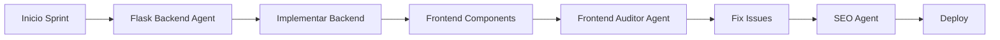

# 🚀 ROADMAP - Editor de Plantillas de Invitación

## 📋 Estado Actual del Proyecto

### ✅ **Completado**
- [x] Sistema base de plantillas (3 plantillas activas)
- [x] Páginas de visualización de plantillas (`/plantillas/[id]`)
- [x] Páginas demo funcionales (`/invitacion/demo/[id]`)
- [x] Sistema de carrito y checkout básico
- [x] Autenticación de usuarios
- [x] Estructura de base de datos básica
- [x] Documentación completa de campos editables (`TEMPLATE_FIELDS.md`)

### 🎯 **Objetivo Final**
Crear un editor completo donde los usuarios puedan personalizar sus invitaciones digitales con todos los campos definidos en `TEMPLATE_FIELDS.md`.

---

## 🏗️ **FASE 1: INFRAESTRUCTURA BACKEND**

### **1.1 Base de Datos - Nuevas Tablas** 
*Prioridad: 🔴 Alta | Tiempo estimado: 2-3 días*

#### **Archivos a crear/modificar:**
- `backend/models/invitation_data.py`
- `backend/models/invitation_media.py` 
- `backend/models/invitation_events.py`
- `backend/migrations/versions/add_invitation_editor_tables.py`

#### **Tareas específicas:**
```sql
-- 1. Tabla para datos editables de invitación
CREATE TABLE invitation_data (
  id INT PRIMARY KEY AUTO_INCREMENT,
  invitation_id INT NOT NULL,
  field_category VARCHAR(50),   -- 'couple', 'event', 'gallery', etc.
  field_name VARCHAR(100),      -- 'couple_groom_name', 'event_date', etc.
  field_value TEXT,             -- Valor del campo (JSON para arrays/objects)
  field_type VARCHAR(50),       -- 'text', 'date', 'file', 'color', etc.
  created_at TIMESTAMP DEFAULT CURRENT_TIMESTAMP,
  updated_at TIMESTAMP DEFAULT CURRENT_TIMESTAMP ON UPDATE CURRENT_TIMESTAMP,
  FOREIGN KEY (invitation_id) REFERENCES invitations(id),
  INDEX idx_invitation_field (invitation_id, field_category, field_name)
);

-- 2. Tabla para archivos multimedia
CREATE TABLE invitation_media (
  id INT PRIMARY KEY AUTO_INCREMENT,
  invitation_id INT NOT NULL,
  media_type ENUM('hero', 'gallery', 'dresscode', 'og_image', 'music'),
  field_name VARCHAR(100),      -- Nombre del campo que almacena este archivo
  file_path VARCHAR(500),       -- Ruta del archivo en el servidor
  original_filename VARCHAR(200),
  file_size INT,               -- Tamaño en bytes
  mime_type VARCHAR(100),      -- image/jpeg, audio/mp3, etc.
  display_order INT DEFAULT 0, -- Para galerías
  created_at TIMESTAMP DEFAULT CURRENT_TIMESTAMP,
  FOREIGN KEY (invitation_id) REFERENCES invitations(id),
  INDEX idx_invitation_media (invitation_id, media_type)
);

-- 3. Tabla para eventos del itinerario
CREATE TABLE invitation_events (
  id INT PRIMARY KEY AUTO_INCREMENT,
  invitation_id INT NOT NULL,
  event_name VARCHAR(200),
  event_datetime DATETIME,
  event_venue VARCHAR(200),
  event_address TEXT,
  event_lat DECIMAL(10, 8),    -- Latitud
  event_lng DECIMAL(11, 8),    -- Longitud
  event_description TEXT,
  event_icon VARCHAR(50),      -- 'church', 'party', 'dinner', etc.
  event_order INT DEFAULT 0,
  created_at TIMESTAMP DEFAULT CURRENT_TIMESTAMP,
  FOREIGN KEY (invitation_id) REFERENCES invitations(id),
  INDEX idx_invitation_events (invitation_id, event_order)
);

-- 4. Tabla principal de invitaciones (extender existente)
ALTER TABLE invitations ADD COLUMN status ENUM('draft', 'published', 'archived') DEFAULT 'draft';
ALTER TABLE invitations ADD COLUMN custom_url VARCHAR(100) UNIQUE;
ALTER TABLE invitations ADD COLUMN privacy_password VARCHAR(100);
ALTER TABLE invitations ADD COLUMN published_at TIMESTAMP NULL;
```

#### **Modelos SQLAlchemy:**
```python
# backend/models/invitation_data.py
class InvitationData(db.Model):
    __tablename__ = 'invitation_data'
    
    id = db.Column(db.Integer, primary_key=True)
    invitation_id = db.Column(db.Integer, db.ForeignKey('invitations.id'), nullable=False)
    field_category = db.Column(db.String(50), nullable=False)
    field_name = db.Column(db.String(100), nullable=False)
    field_value = db.Column(db.Text)
    field_type = db.Column(db.String(50))
    created_at = db.Column(db.DateTime, default=datetime.utcnow)
    updated_at = db.Column(db.DateTime, default=datetime.utcnow, onupdate=datetime.utcnow)
    
    # Relationship
    invitation = db.relationship('Invitation', backref='data_fields')
```

### **1.2 API Endpoints para Editor**
*Prioridad: 🔴 Alta | Tiempo estimado: 3-4 días*

#### **Archivos a crear:**
- `backend/api/invitation_editor.py`
- `backend/api/invitation_media.py`

#### **Endpoints necesarios:**
```python
# Gestión de datos de invitación
POST   /api/invitations/{id}/data           # Guardar datos del formulario
GET    /api/invitations/{id}/data           # Obtener todos los datos
PUT    /api/invitations/{id}/data/{field}   # Actualizar campo específico
DELETE /api/invitations/{id}/data/{field}   # Eliminar campo

# Gestión de archivos multimedia
POST   /api/invitations/{id}/media          # Subir archivos (imágenes, audio)
GET    /api/invitations/{id}/media          # Listar archivos
DELETE /api/invitations/{id}/media/{mediaId} # Eliminar archivo

# Gestión de eventos del itinerario
POST   /api/invitations/{id}/events         # Crear evento
GET    /api/invitations/{id}/events         # Listar eventos
PUT    /api/invitations/{id}/events/{eventId} # Actualizar evento
DELETE /api/invitations/{id}/events/{eventId} # Eliminar evento

# Vista previa y publicación
GET    /api/invitations/{id}/preview        # Vista previa con datos actuales
POST   /api/invitations/{id}/publish        # Publicar invitación
POST   /api/invitations/{id}/unpublish      # Despublicar invitación

# Validación de URL personalizada
GET    /api/invitations/check-url/{url}     # Verificar disponibilidad de URL
```

### **1.3 Sistema de Archivos y Upload con FTP**
*Prioridad: 🟡 Media | Tiempo estimado: 2-3 días*

#### **Configuración FTP necesaria:**
```python
# backend/config.py - Configuración FTP desde .env
import os
from ftplib import FTP

FTP_CONFIG = {
    'host': os.getenv('FTP_HOST', 'ftp.kossomet.com'),
    'user': os.getenv('FTP_USER', 'marketing@kossomet.com'),
    'password': os.getenv('FTP_PASS', '#k55d.202$INT'),
    'base_path': '/public_html/invita/',
    'base_url': 'https://kossomet.com/invita/'
}

MAX_FILE_SIZE = 5 * 1024 * 1024  # 5MB
ALLOWED_EXTENSIONS = {
    'images': {'jpg', 'jpeg', 'png', 'webp', 'gif'},
    'audio': {'mp3', 'wav', 'ogg'},
    'video': {'mp4', 'webm'}
}

# Estructura de carpetas en FTP:
# ftp.kossomet.com/public_html/invita/
# ├── invitations/
# │   ├── {invitation_id}/
# │   │   ├── images/
# │   │   │   ├── hero/
# │   │   │   ├── gallery/
# │   │   │   └── dresscode/
# │   │   ├── audio/
# │   │   └── documents/
# │   └── temp/  # Para uploads temporales
```

#### **Clase FTP Manager:**
```python
# backend/utils/ftp_manager.py
import ftplib
import os
from pathlib import Path

class FTPManager:
    """
    WHY: Centralizar todas las operaciones FTP para subida de archivos
    de invitaciones al servidor externo kossomet.com
    """
    
    def __init__(self):
        self.config = FTP_CONFIG
        self.connection = None
    
    def connect(self):
        """Establecer conexión FTP"""
        self.connection = ftplib.FTP(self.config['host'])
        self.connection.login(self.config['user'], self.config['password'])
        # Navegar a la carpeta base
        self.connection.cwd('/public_html/invita')
    
    def upload_file(self, local_path: str, remote_path: str) -> str:
        """
        Subir archivo al FTP y retornar URL pública
        Returns: URL completa del archivo (https://kossomet.com/invita/...)
        """
        self.ensure_directory(os.path.dirname(remote_path))
        with open(local_path, 'rb') as file:
            self.connection.storbinary(f'STOR {remote_path}', file)
        return f"{self.config['base_url']}{remote_path}"
    
    def ensure_directory(self, path: str):
        """Crear directorios si no existen"""
        dirs = path.split('/')
        for i in range(len(dirs)):
            subdir = '/'.join(dirs[:i+1])
            if subdir:
                try:
                    self.connection.mkd(subdir)
                except:
                    pass  # El directorio ya existe
    
    def delete_file(self, remote_path: str):
        """Eliminar archivo del FTP"""
        try:
            self.connection.delete(remote_path)
        except:
            pass  # El archivo no existe
    
    def close(self):
        """Cerrar conexión FTP"""
        if self.connection:
            self.connection.quit()
```

#### **URLs públicas de archivos:**
```
# Los archivos subidos estarán disponibles en:
https://kossomet.com/invita/invitations/{invitation_id}/images/hero/image.jpg
https://kossomet.com/invita/invitations/{invitation_id}/gallery/photo1.jpg
https://kossomet.com/invita/invitations/{invitation_id}/audio/background-music.mp3
```

---

## ⚛️ **FASE 2: FRONTEND - COMPONENTES DE EDICIÓN**

### **2.1 Hooks y Utilities**
*Prioridad: 🔴 Alta | Tiempo estimado: 2-3 días*

#### **Archivos a crear:**
- `frontend/src/hooks/useInvitationEditor.ts`
- `frontend/src/hooks/useAutoSave.ts`
- `frontend/src/hooks/useFileUpload.ts`
- `frontend/src/lib/invitation-api.ts`
- `frontend/src/types/invitation.ts`

#### **Hooks principales:**
```typescript
// useInvitationEditor.ts - Hook principal para manejo de estado
interface UseInvitationEditorReturn {
  data: InvitationData;
  updateField: (category: string, field: string, value: any) => void;
  uploadFile: (file: File, fieldName: string) => Promise<string>;
  saveData: () => Promise<void>;
  isLoading: boolean;
  isDirty: boolean;
  errors: Record<string, string>;
}

// useAutoSave.ts - Guardado automático cada 30 segundos
const useAutoSave = (data: any, saveFunction: () => Promise<void>) => {
  // Implementar debounce y guardado automático
}

// useFileUpload.ts - Manejo de subida de archivos
const useFileUpload = () => {
  const uploadFile = async (file: File, invitationId: number, fieldName: string) => {
    // Validar archivo, comprimir si es imagen, subir al servidor
  }
}
```

### **2.2 Componentes Base del Editor**
*Prioridad: 🔴 Alta | Tiempo estimado: 4-5 días*

#### **Archivos a crear:**
- `frontend/src/components/editor/InvitationEditor.tsx`
- `frontend/src/components/editor/EditorSidebar.tsx`
- `frontend/src/components/editor/FormSection.tsx`
- `frontend/src/components/editor/PreviewPanel.tsx`
- `frontend/src/components/editor/SaveStatus.tsx`

#### **Estructura del Editor:**
```tsx
// InvitationEditor.tsx - Componente principal
const InvitationEditor = ({ invitationId }: { invitationId: number }) => {
  return (
    <div className="editor-layout">
      {/* Barra lateral con secciones */}
      <EditorSidebar 
        sections={FORM_SECTIONS}
        activeSection={activeSection}
        onSectionChange={setActiveSection}
        completedSections={completedSections}
      />
      
      {/* Área principal del formulario */}
      <div className="editor-main">
        <EditorHeader 
          invitationTitle={data.couple_bride_name + ' & ' + data.couple_groom_name}
          saveStatus={saveStatus}
          onPreview={openPreview}
          onPublish={publishInvitation}
        />
        
        <FormSection 
          section={activeSection}
          data={data}
          onUpdate={updateField}
          onFileUpload={uploadFile}
          errors={errors}
        />
      </div>
      
      {/* Panel de vista previa (opcional, colapsible) */}
      <PreviewPanel 
        invitationId={invitationId}
        data={data}
        visible={showPreview}
      />
    </div>
  );
};
```

### **2.3 Componentes Especializados**
*Prioridad: 🟡 Media | Tiempo estimado: 3-4 días*

#### **Archivos a crear:**
- `frontend/src/components/editor/sections/CoupleSection.tsx`
- `frontend/src/components/editor/sections/EventSection.tsx`
- `frontend/src/components/editor/sections/ScheduleSection.tsx`
- `frontend/src/components/editor/sections/GallerySection.tsx`
- `frontend/src/components/editor/LocationPicker.tsx`
- `frontend/src/components/editor/ImageUploader.tsx`
- `frontend/src/components/editor/ColorPicker.tsx`

#### **Componentes complejos:**
```tsx
// LocationPicker.tsx - Selector de ubicación con mapa
const LocationPicker = ({ 
  value, 
  onChange,
  placeholder = "Buscar ubicación..."
}) => {
  // Integración con Google Maps API
  // Autocompletado de direcciones
  // Selector visual en mapa
  // Opción de pegar URL de Google Maps
}

// ImageUploader.tsx - Subida de imágenes con preview
const ImageUploader = ({
  fieldName,
  currentImage,
  onUpload,
  onRemove,
  multiple = false,
  maxFiles = 1,
  recommendedSize = "1920x1080px"
}) => {
  // Drag & drop
  // Compresión automática
  // Crop/resize
  // Preview con opciones de eliminar
}

// ColorPicker.tsx - Selector de colores con paletas predefinidas
const ColorPicker = ({ 
  value, 
  onChange,
  presets = [], 
  showAlpha = false 
}) => {
  // Selector de color visual
  // Paletas predefinidas
  // Input hex manual
  // Preview del color
}
```

---

## 🎨 **FASE 3: PÁGINAS DE USUARIO**

### **3.1 Flujo de Creación de Invitación**
*Prioridad: 🔴 Alta | Tiempo estimado: 2-3 días*

#### **Páginas nuevas a crear:**
- `frontend/src/app/mi-cuenta/invitaciones/crear/page.tsx`
- `frontend/src/app/mi-cuenta/invitaciones/[id]/editar/page.tsx`
- `frontend/src/app/mi-cuenta/invitaciones/[id]/preview/page.tsx`

#### **Flujo completo:**
```
1. Usuario compra plantilla → Order creada
2. /mi-cuenta/invitaciones → Lista de invitaciones del usuario
3. /mi-cuenta/invitaciones/crear → Seleccionar plantilla comprada
4. /mi-cuenta/invitaciones/{id}/editar → Editor completo
5. /mi-cuenta/invitaciones/{id}/preview → Vista previa privada
6. /invitacion/{custom_url} → Invitación pública publicada
```

### **3.2 Gestión de Invitaciones en Mi Cuenta**
*Prioridad: 🟡 Media | Tiempo estimado: 2 días*

#### **Funcionalidades:**
- Lista de invitaciones del usuario (drafts, published, archived)
- Cards con preview, status, fecha de creación
- Acciones: Editar, Duplicar, Archivar, Eliminar
- Estadísticas básicas: Vistas, confirmaciones, etc.

### **3.3 Sistema de Vista Previa y URLs Públicas**
*Prioridad: 🔴 Alta | Tiempo estimado: 2-3 días*

#### **Características:**
- Preview en tiempo real mientras se edita
- URL temporal para compartir preview
- Modo preview vs modo público
- Responsive preview (mobile, tablet, desktop)

#### **Sistema de URLs Personalizadas:**
```python
# URLs de invitaciones públicas
# Formato: https://kossomet.com/invita/{custom_url}

# Ejemplos:
https://kossomet.com/invita/boda-carlos-maria-2025
https://kossomet.com/invita/nuestra-boda-junio
https://kossomet.com/invita/cm2025

# Backend validation
def validate_custom_url(url: str) -> bool:
    """
    WHY: Validar que la URL personalizada cumpla requisitos
    - Solo letras, números y guiones
    - Entre 5 y 50 caracteres
    - No puede empezar/terminar con guión
    - Debe ser única
    """
    import re
    pattern = r'^[a-z0-9][a-z0-9-]{3,48}[a-z0-9]$'
    return bool(re.match(pattern, url.lower()))
```

#### **Generación de Invitación Estática:**
```python
# backend/services/invitation_generator.py
class InvitationGenerator:
    """
    WHY: Generar HTML estático de la invitación para subir al FTP
    """
    
    def generate_static_html(self, invitation_id: int) -> str:
        """
        Generar HTML completo con:
        - Todos los datos de la invitación
        - CSS inline para máxima compatibilidad
        - JavaScript mínimo para interactividad
        - URLs absolutas para recursos (imágenes en kossomet.com/invita/)
        """
        invitation = Invitation.query.get(invitation_id)
        template = Template.query.get(invitation.template_id)
        data = self.get_invitation_data(invitation_id)
        
        # Renderizar template con Jinja2
        html = render_template(
            f'invitations/{template.template_file}',
            invitation=invitation,
            data=data,
            base_url='https://kossomet.com/invita/'
        )
        
        # Minificar HTML
        return minify_html(html)
    
    def publish_to_ftp(self, invitation_id: int, custom_url: str):
        """
        Publicar invitación en FTP
        """
        html = self.generate_static_html(invitation_id)
        
        ftp = FTPManager()
        ftp.connect()
        
        # Guardar como index.html en carpeta personalizada
        remote_path = f'{custom_url}/index.html'
        ftp.upload_content(html, remote_path)
        
        # Copiar recursos (CSS, JS, imágenes)
        self.copy_invitation_resources(invitation_id, custom_url, ftp)
        
        ftp.close()
        
        return f'https://kossomet.com/invita/{custom_url}'
```

---

## 🔧 **FASE 4: FUNCIONALIDADES AVANZADAS**

### **4.1 Sistema de Personalización Visual**
*Prioridad: 🟡 Media | Tiempo estimado: 3-4 días*

#### **Características:**
- Selector de colores con paletas predefinidas
- Selector de tipografías
- Temas predefinidos por tipo de boda
- Preview de cambios en tiempo real

### **4.2 Sistema de RSVP Personalizable**
*Prioridad: 🟡 Media | Tiempo estimado: 4-5 días*

#### **Funcionalidades:**
- Formulario RSVP personalizable
- Preguntas adicionales configurables
- Límites de invitados
- Exportación de respuestas
- Notificaciones por email

### **4.3 Analytics y Estadísticas**
*Prioridad: 🟢 Baja | Tiempo estimado: 2-3 días*

#### **Métricas:**
- Número de vistas de la invitación
- Tasa de confirmación de asistencia
- Países/ciudades de los visitantes
- Dispositivos más usados

---

## 📱 **FASE 5: OPTIMIZACIONES Y MEJORAS**

### **5.1 Performance y SEO**
*Prioridad: 🟡 Media | Tiempo estimado: 2-3 días*

#### **Optimizaciones:**
- Lazy loading de imágenes
- Compresión automática de archivos
- Meta tags dinámicos para compartir
- Sitemap para invitaciones públicas
- Cache de vista previa

### **5.2 PWA y Offline**
*Prioridad: 🟢 Baja | Tiempo estimado: 3-4 días*

#### **Características:**
- Service worker para cache
- Funcionalidad offline básica
- Instalable como app
- Push notifications para RSVP

### **5.3 Integraciones Externas**
*Prioridad: 🟢 Baja | Tiempo estimado: Variable*

#### **Posibles integraciones:**
- Google Calendar (agregar evento)
- WhatsApp (compartir invitación)
- Social media sharing optimizado
- Google Analytics
- Mailchimp para newsletters

---

## 📊 **CRONOGRAMA ESTIMADO**

### **Sprints Sugeridos (2 semanas cada uno):**

#### **Sprint 1: Backend Foundation** (Semanas 1-2)
- ✅ Modelos de base de datos
- ✅ Migración de tablas
- ✅ API endpoints básicos
- ✅ Sistema de upload de archivos

#### **Sprint 2: Frontend Core** (Semanas 3-4)
- ✅ Hooks y utilities
- ✅ Componentes base del editor
- ✅ Secciones básicas (Couple, Event)
- ✅ Integración con API

#### **Sprint 3: Editor Completo** (Semanas 5-6)
- ✅ Todas las secciones del formulario
- ✅ Componentes especializados
- ✅ Sistema de preview
- ✅ Validaciones y guardado

#### **Sprint 4: User Experience** (Semanas 7-8)
- ✅ Páginas de gestión
- ✅ Flujo completo de usuario
- ✅ Sistema de publicación
- ✅ Testing y refinamiento

#### **Sprint 5: Polish & Features** (Semanas 9-10)
- ✅ Funcionalidades avanzadas
- ✅ Optimizaciones
- ✅ Analytics básicos
- ✅ Deployment y monitoreo

---

## 🎯 **CRITERIOS DE ÉXITO**

### **MVP (Mínimo Producto Viable):**
- [ ] Usuario puede editar los campos básicos de su invitación
- [ ] Sistema de subida de imágenes funcional
- [ ] Vista previa en tiempo real
- [ ] Publicación de invitación con URL personalizada
- [ ] RSVP básico funcional

### **Versión Completa:**
- [ ] Todas las secciones de TEMPLATE_FIELDS.md implementadas
- [ ] Editor responsive y user-friendly
- [ ] Sistema completo de RSVP con analytics
- [ ] Personalización visual avanzada
- [ ] Performance optimizada (<3s load time)

---

## 🤖 **USO DE AGENTES ESPECIALIZADOS**

### **Agentes Disponibles en el Proyecto:**

#### **1. Flask Enterprise Backend Agent** 🟡
*Archivo: `.claude/agents/flask-enterprise-backend.md`*

**Usar para:**
- Diseñar e implementar toda la arquitectura backend
- Configurar SQLAlchemy con mejores prácticas
- Implementar seguridad (JWT, rate limiting, CORS)
- Optimizar performance de queries y endpoints
- Configurar logging estructurado y monitoreo
- Implementar tests con 80%+ coverage
- Configurar CI/CD pipelines

**Tareas específicas del roadmap:**
- FASE 1.1: Crear modelos de base de datos con docstrings completos
- FASE 1.2: Implementar API endpoints con validación estricta
- FASE 1.3: Sistema FTP con manejo de errores robusto
- Configurar Redis para cache de previews
- Implementar rate limiting para uploads

#### **2. Frontend Technical Auditor Agent** 🟡
*Archivo: `.claude/agents/frontend-technical-auditor.md`*

**Usar para:**
- Verificar que todos los componentes rendericen sin errores
- Detectar problemas de hydration en Next.js
- Auditar TypeScript types y validaciones
- Verificar accesibilidad WCAG 2.1
- Detectar memory leaks y problemas de performance
- Validar SEO y meta tags

**Tareas específicas del roadmap:**
- FASE 2: Auditar todos los componentes del editor
- FASE 3: Verificar flujo completo sin errores de consola
- FASE 5.1: Auditoría de performance y Core Web Vitals
- Verificar responsive design en todos los dispositivos

#### **3. SEO Optimization Specialist Agent** 🟢
*Archivo: `.claude/agents/seo-optimization-specialist.md`*

**Usar para:**
- Optimizar meta tags dinámicos para invitaciones
- Configurar Open Graph para compartir en redes
- Implementar schema.org para eventos
- Optimizar URLs amigables
- Configurar sitemap dinámico
- Mejorar Core Web Vitals

**Tareas específicas del roadmap:**
- FASE 3.3: Meta tags dinámicos para preview
- FASE 5.1: Optimización SEO completa
- Configurar canonical URLs
- Implementar JSON-LD para eventos

### **Flujo de Trabajo con Agentes:**



### **Comandos para Invocar Agentes:**

```bash
# Para backend tasks
claude --agent flask-enterprise-backend "Implementar modelos de invitation_data con validaciones"

# Para auditoría frontend
claude --agent frontend-technical-auditor "Auditar el componente InvitationEditor"

# Para SEO
claude --agent seo-optimization-specialist "Optimizar meta tags para invitación {id}"
```

---

## 🔄 **METODOLOGÍA DE DESARROLLO**

### **Recomendaciones:**
1. **Desarrollo iterativo**: Una sección a la vez, funcional end-to-end
2. **Testing continuo**: Probar cada funcionalidad inmediatamente
3. **Feedback temprano**: Vista previa disponible desde el primer día
4. **Mobile-first**: Diseñar para móviles desde el inicio
5. **Data-driven**: Implementar analytics desde el principio
6. **Agent-driven**: Usar agentes especializados para cada dominio

### **Herramientas de seguimiento:**
- [ ] GitHub Projects para tracking
- [ ] Branch strategy (main, develop, feature branches)
- [ ] Automated testing (Jest, Cypress)
- [ ] CI/CD pipeline
- [ ] Error monitoring (Sentry)

---

## 🚨 **RIESGOS Y MITIGACIONES**

### **Riesgos Técnicos:**
1. **Performance con archivos grandes**
   - *Mitigación*: Compresión automática, CDN, lazy loading

2. **Complejidad del estado del editor**
   - *Mitigación*: Usar Zustand/Redux, hooks bien estructurados

3. **Compatibilidad mobile**
   - *Mitigación*: Testing extensivo en dispositivos reales

### **Riesgos de Producto:**
1. **UX demasiado compleja**
   - *Mitigación*: Diseño progresivo, tutoriales, campos opcionales

2. **Tiempo de desarrollo subestimado**
   - *Mitigación*: Buffer del 25% en estimaciones, sprints cortos

---

## 📝 **NOTAS IMPORTANTES**

### **Decisiones de Arquitectura:**
- **Frontend**: React + TypeScript + Tailwind CSS
- **Backend**: Flask + SQLAlchemy + MySQL
- **Files**: Local storage inicialmente, S3 en producción
- **Maps**: Google Maps API para location picker
- **State**: Zustand para estado global, React Query para server state

### **Consideraciones de Negocio:**
- **Monetización**: Funciones premium para planes superiores
- **Escalabilidad**: Arquitectura preparada para múltiples templates
- **Internacionalización**: Preparado para múltiples idiomas
- **White-label**: Estructura lista para personalización de marca

---

*Documento creado para AmiraGift - Sistema de Invitaciones Digitales*  
*Versión 1.0 - Enero 2025*  
*Última actualización: Después de implementar estructura de campos editables*