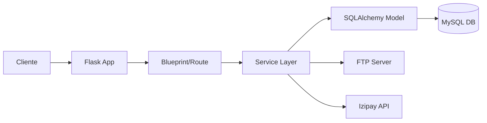
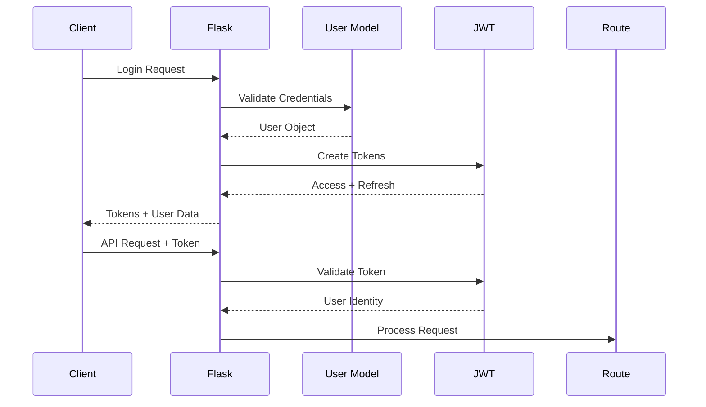

# Backend Architecture Documentation

## 🏗️ Estructura General

```
backend/
├── api/                    # Endpoints organizados por módulo
│   ├── __init__.py
│   ├── admin.py           # Panel administrativo
│   ├── auth.py            # Autenticación JWT
│   ├── cart.py            # Carrito de compras
│   ├── coupons.py         # Sistema de cupones
│   ├── invitation_editor.py # Editor avanzado
│   ├── invitation_urls.py  # URLs cortas
│   ├── invitations.py     # CRUD invitaciones
│   ├── orders.py          # Gestión de órdenes
│   ├── payments.py        # Integración Izipay
│   ├── plans.py           # Planes de servicio
│   ├── redirect.py        # Redirecciones
│   ├── templates.py       # Plantillas
│   └── users.py           # Usuarios
│
├── models/                 # Modelos SQLAlchemy
│   ├── __init__.py
│   ├── claim.py           # Reclamos
│   ├── coupon.py          # Cupones y uso
│   ├── invitation.py      # Invitaciones base
│   ├── invitation_data.py # Datos extendidos
│   ├── invitation_event.py # Eventos timeline
│   ├── invitation_media.py # Archivos multimedia
│   ├── invitation_response.py # Respuestas RSVP
│   ├── invitation_url.py  # URLs personalizadas
│   ├── order.py           # Órdenes y items
│   ├── plan.py            # Planes de servicio
│   ├── template.py        # Plantillas
│   ├── testimonial.py    # Testimonios
│   └── user.py            # Usuarios
│
├── services/              # Servicios de negocio
│   └── file_upload_service.py # Manejo de archivos
│
├── utils/                 # Utilidades
│   ├── __init__.py
│   ├── file_processing.py # Procesamiento imágenes
│   ├── ftp_manager.py    # Cliente FTP
│   ├── logging_config.py # Configuración logs
│   └── url_utils.py      # Utilidades URLs
│
├── migrations/            # Migraciones Alembic
│   ├── alembic.ini
│   ├── env.py
│   └── versions/
│
├── tests/                 # Tests
│   ├── test_api.py
│   ├── test_complete.py
│   ├── test_invitation_editor.py
│   └── ...
│
├── app.py                # Application factory
├── extensions.py         # Extensions (db, jwt, etc)
├── init_db.py           # Database initialization
├── requirements.txt     # Dependencies
└── .env                # Environment variables
```

## 🔧 Patrones y Principios

### 1. Application Factory Pattern
```python
# app.py
def create_app(config_name=None):
    app = Flask(__name__)

    # Configuración
    app.config['...'] = ...

    # Inicializar extensiones
    db.init_app(app)
    jwt.init_app(app)

    # Registrar blueprints
    app.register_blueprint(auth_bp, url_prefix='/api/auth')

    return app
```

### 2. Centralized Extensions
```python
# extensions.py
from flask_sqlalchemy import SQLAlchemy
from flask_jwt_extended import JWTManager

db = SQLAlchemy()
jwt = JWTManager()
ma = Marshmallow()

# Evita imports circulares
```

### 3. Blueprint Organization
Cada módulo API es un Blueprint independiente:
```python
# api/auth.py
auth_bp = Blueprint('auth', __name__)

@auth_bp.route('/login', methods=['POST'])
def login():
    # ...
```

### 4. Service Layer Pattern
```python
# services/file_upload_service.py
class FileUploadService:
    def upload_file(self, file, invitation_id):
        # Validación
        # Procesamiento
        # Upload FTP
        # Guardar en DB
        return media_record
```

## 📊 Flujo de Datos

### Request Flow


### Authentication Flow


## 🗄️ Base de Datos

### Esquema Principal

```sql
-- Usuarios y Autenticación
users
├── id (PK)
├── email (UNIQUE)
├── password_hash
├── role (admin/user)
└── timestamps

-- Invitaciones
invitations
├── id (PK)
├── user_id (FK)
├── template_id (FK)
├── order_id (FK)
├── is_published
└── timestamps

invitation_data
├── id (PK)
├── invitation_id (FK, UNIQUE)
├── couple_groom_name
├── couple_bride_name
├── event_date
└── [60+ campos adicionales]

invitation_media
├── id (PK)
├── invitation_id (FK)
├── media_type
├── file_path
└── display_order

invitation_events
├── id (PK)
├── invitation_id (FK)
├── event_type
├── date/time
└── venue_info

invitation_responses
├── id (PK)
├── invitation_id (FK)
├── guest_name
├── status (confirmed/declined)
└── number_of_guests

-- Comercio
orders
├── id (PK)
├── user_id (FK)
├── order_number (UNIQUE)
├── status
├── total
└── payment_status

order_items
├── id (PK)
├── order_id (FK)
├── plan_id (FK)
├── template_id (FK)
├── quantity
└── price

-- Sistema
templates
├── id (PK)
├── name
├── category
├── price
└── preview_url

plans
├── id (PK)
├── name (Standard/Exclusive)
├── price
└── features (JSON)

coupons
├── id (PK)
├── code (UNIQUE)
├── discount_type
├── discount_value
└── valid_until
```

### Relaciones Principales
- User **1:N** Invitation
- Invitation **1:1** InvitationData
- Invitation **1:N** InvitationMedia
- Invitation **1:N** InvitationEvent
- Invitation **1:N** InvitationResponse
- Order **1:N** OrderItem
- User **1:N** Order

## 🔐 Seguridad

### JWT Configuration
- **Access Token**: 15 minutos
- **Refresh Token**: 7 días
- **Algorithm**: HS256
- **Location**: Authorization header

### Password Hashing
```python
# bcrypt con salt automático
from bcrypt import hashpw, gensalt, checkpw

def set_password(self, password):
    self.password_hash = hashpw(
        password.encode('utf-8'),
        gensalt()
    ).decode('utf-8')
```

### CORS Policy
```python
CORS(app,
     origins=['http://localhost:3000', 'http://localhost:3001'],
     supports_credentials=True,
     allow_headers=['Content-Type', 'Authorization'])
```

## 🔄 Integración Externa

### FTP Server (Kossomet)
```python
# utils/ftp_manager.py
class FTPManager:
    def upload_file(self, local_path, remote_path):
        # Conexión segura FTPS
        # Upload con reintentos
        # Verificación de integridad
```

### Izipay Payment Gateway
```python
# api/payments.py
IZIPAY_ENDPOINTS = {
    'SANDBOX': 'https://api.micuentaweb.pe',
    'PRODUCTION': 'https://api.micuentaweb.pe'
}

# Validación HMAC para webhooks
def validate_webhook_signature(kr_hash, kr_answer):
    expected = hmac.new(
        IZIPAY_PASSWORD.encode(),
        kr_answer.encode(),
        hashlib.sha256
    ).hexdigest()
    return hmac.compare_digest(expected, kr_hash)
```

## 📝 Logging Strategy

### Configuración
```python
# utils/logging_config.py
logging.basicConfig(
    level=logging.INFO,
    format='%(asctime)s - %(name)s - %(levelname)s - %(message)s'
)
```

### Niveles de Log
- **DEBUG**: Desarrollo local
- **INFO**: Operaciones normales
- **WARNING**: Situaciones inesperadas
- **ERROR**: Errores recuperables
- **CRITICAL**: Errores del sistema

## 🚀 Deployment

### Environment Variables
```bash
# Base de datos
DB_HOST=localhost
DB_USER=root
DB_PASSWORD=secret
DB_NAME=invitaciones_web

# Seguridad
SECRET_KEY=random-secret-key
JWT_SECRET=jwt-secret-key

# Servicios externos
IZIPAY_USERNAME=username
IZIPAY_PASSWORD=password
FTP_HOST=ftp.kossomet.com
```

### Production Checklist
- [ ] Variables de entorno configuradas
- [ ] Base de datos migrada
- [ ] HTTPS habilitado
- [ ] Rate limiting configurado
- [ ] Logs centralizados
- [ ] Backups automatizados
- [ ] Monitoreo activo

## 🔄 Request Lifecycle

1. **Request llega a Flask**
   - CORS validation
   - Rate limiting check

2. **JWT Validation** (si es requerido)
   - Token extraction
   - Signature validation
   - User lookup

3. **Route Processing**
   - Input validation (Marshmallow)
   - Business logic
   - Database operations

4. **Service Layer** (si aplica)
   - File processing
   - External API calls
   - Complex operations

5. **Response**
   - JSON serialization
   - Status code
   - Headers

## 🛠️ Development Workflow

### Adding New Feature
1. Create/update model in `models/`
2. Create migration: `flask db migrate`
3. Add API routes in `api/`
4. Add service logic if needed
5. Write tests
6. Update documentation

### Database Changes
```bash
# Crear migración
flask db migrate -m "Add new field"

# Aplicar migración
flask db upgrade

# Rollback si es necesario
flask db downgrade
```

## 📊 Performance Considerations

### Database Optimization
- Indexes en campos de búsqueda frecuente
- Lazy loading para relaciones
- Query optimization con `joinedload`

### Caching Strategy
- No implementado actualmente
- Candidatos: Templates, Plans, User sessions

### File Upload Optimization
- Procesamiento asíncrono de imágenes
- Generación de thumbnails
- Compresión automática

## 🔍 Error Handling

### Global Error Handlers
```python
@app.errorhandler(404)
def not_found(error):
    return {'error': 'not_found'}, 404

@app.errorhandler(500)
def internal_error(error):
    return {'error': 'internal_server_error'}, 500
```

### Business Logic Errors
```python
class ValidationError(Exception):
    pass

class PaymentError(Exception):
    pass

class FTPUploadError(Exception):
    pass
```

## 📈 Monitoring Points

### Health Checks
- `/health` - Sistema general
- `/api/payments/health` - Izipay
- Database connectivity
- FTP connectivity

### Metrics to Track
- Response times
- Error rates
- Payment success rate
- File upload success rate
- Active users
- API usage by endpoint