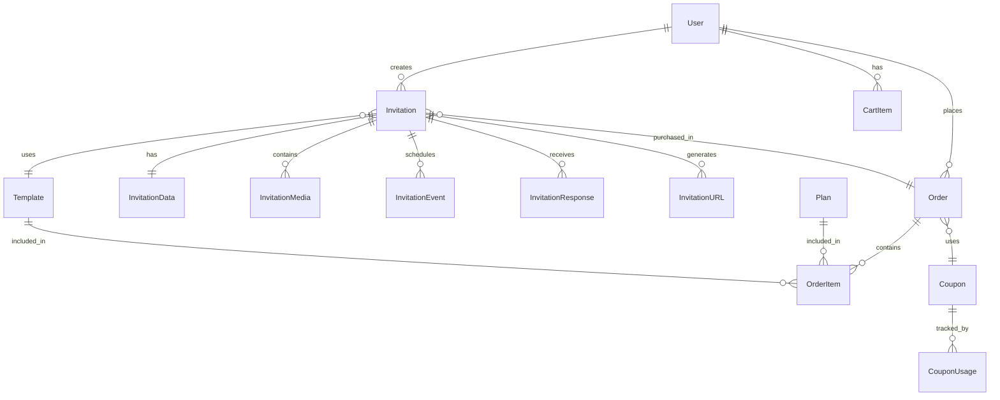

# Database Models Documentation

## 📊 Esquema General

El sistema utiliza **SQLAlchemy ORM** con **MySQL** como base de datos principal. La estructura está organizada en dominios funcionales claros.

## 🗂️ Modelos por Dominio

### 1. Autenticación y Usuarios

#### User Model
**Archivo**: `models/user.py`
**Tabla**: `users`

| Campo | Tipo | Descripción | Constraints |
|-------|------|-------------|------------|
| id | Integer | ID único | PRIMARY KEY, AUTO_INCREMENT |
| email | String(120) | Email del usuario | UNIQUE, NOT NULL |
| password_hash | String(200) | Hash bcrypt de contraseña | NOT NULL |
| first_name | String(50) | Nombre | NOT NULL |
| last_name | String(50) | Apellido | NOT NULL |
| phone | String(20) | Teléfono | NULLABLE |
| role | Enum | 'admin' o 'user' | DEFAULT 'user' |
| is_active | Boolean | Cuenta activa | DEFAULT True |
| email_verified | Boolean | Email verificado | DEFAULT False |
| created_at | DateTime | Fecha creación | DEFAULT NOW |
| updated_at | DateTime | Última actualización | ON UPDATE NOW |

**Relaciones**:
- `orders`: One-to-Many con Order
- `invitations`: One-to-Many con Invitation
- `cart_items`: One-to-Many con CartItem

**Métodos importantes**:
```python
def set_password(self, password): # Hashea y guarda contraseña
def check_password(self, password): # Verifica contraseña
def to_dict(): # Serialización (excluye password)
```

---

### 2. Invitaciones

#### Invitation Model
**Archivo**: `models/invitation.py`
**Tabla**: `invitations`

| Campo | Tipo | Descripción | Constraints |
|-------|------|-------------|------------|
| id | Integer | ID único | PRIMARY KEY |
| user_id | Integer | Propietario | FOREIGN KEY(users) |
| template_id | Integer | Plantilla base | FOREIGN KEY(templates), NULLABLE |
| order_id | Integer | Orden asociada | FOREIGN KEY(orders), NULLABLE |
| title | String(200) | Título | NULLABLE |
| slug | String(100) | URL amigable | UNIQUE, NULLABLE |
| is_published | Boolean | Estado publicación | DEFAULT False |
| published_at | DateTime | Fecha publicación | NULLABLE |
| password | String(100) | Protección contraseña | NULLABLE |
| views_count | Integer | Contador visitas | DEFAULT 0 |
| created_at | DateTime | Fecha creación | DEFAULT NOW |
| updated_at | DateTime | Última actualización | ON UPDATE NOW |

**Relaciones**:
- `user`: Many-to-One con User
- `template`: Many-to-One con Template
- `order`: Many-to-One con Order
- `invitation_data`: One-to-One con InvitationData
- `media`: One-to-Many con InvitationMedia
- `events`: One-to-Many con InvitationEvent
- `responses`: One-to-Many con InvitationResponse
- `urls`: One-to-Many con InvitationURL

---

#### InvitationData Model
**Archivo**: `models/invitation_data.py`
**Tabla**: `invitation_data`

| Campo | Tipo | Descripción | Validación |
|-------|------|-------------|------------|
| id | Integer | ID único | PRIMARY KEY |
| invitation_id | Integer | Invitación padre | FOREIGN KEY, UNIQUE |
| **Información de la Pareja** |
| couple_groom_name | String(100) | Nombre del novio | REQUIRED, 2-100 chars |
| couple_bride_name | String(100) | Nombre de la novia | REQUIRED, 2-100 chars |
| couple_groom_parents | String(200) | Padres del novio | OPTIONAL |
| couple_bride_parents | String(200) | Padres de la novia | OPTIONAL |
| couple_story | Text | Historia de amor | OPTIONAL |
| **Información del Evento** |
| event_date | Date | Fecha del evento | REQUIRED, Future date |
| event_time | Time | Hora del evento | REQUIRED |
| event_type | String(50) | Tipo (boda/civil/etc) | OPTIONAL |
| event_duration | String(50) | Duración estimada | OPTIONAL |
| **Ubicación** |
| event_venue_name | String(200) | Nombre del lugar | REQUIRED, 2-200 chars |
| event_venue_address | String(300) | Dirección | REQUIRED |
| event_venue_city | String(100) | Ciudad | OPTIONAL |
| event_venue_state | String(100) | Estado/Provincia | OPTIONAL |
| event_venue_zip | String(20) | Código postal | OPTIONAL |
| event_venue_country | String(100) | País | DEFAULT 'Perú' |
| event_venue_location_url | String(500) | Link Google Maps | OPTIONAL, Valid URL |
| event_venue_parking | String(200) | Info estacionamiento | OPTIONAL |
| **Mensajes** |
| message_welcome_text | Text | Mensaje bienvenida | OPTIONAL |
| message_invitation_text | Text | Texto invitación | OPTIONAL |
| message_ceremony_text | Text | Mensaje ceremonia | OPTIONAL |
| message_reception_text | Text | Mensaje recepción | OPTIONAL |
| message_thank_you | Text | Agradecimiento | OPTIONAL |
| **Galería** |
| gallery_hero_image | String(500) | Imagen principal | REQUIRED |
| gallery_couple_image | String(500) | Foto de pareja | OPTIONAL |
| gallery_engagement_image | String(500) | Foto compromiso | OPTIONAL |
| gallery_venue_image | String(500) | Foto del lugar | OPTIONAL |
| **Diseño** |
| design_primary_color | String(7) | Color primario | HEX format |
| design_secondary_color | String(7) | Color secundario | HEX format |
| design_accent_color | String(7) | Color acento | HEX format |
| design_font_family | String(100) | Fuente principal | OPTIONAL |
| design_font_secondary | String(100) | Fuente secundaria | OPTIONAL |
| design_theme | String(50) | Tema visual | OPTIONAL |
| **RSVP** |
| rsvp_enabled | Boolean | RSVP activo | DEFAULT True |
| rsvp_deadline | Date | Fecha límite RSVP | OPTIONAL |
| rsvp_max_guests | Integer | Máx invitados/persona | DEFAULT 2 |
| rsvp_phone | String(20) | Teléfono RSVP | OPTIONAL |
| rsvp_whatsapp | String(20) | WhatsApp RSVP | OPTIONAL |
| rsvp_email | String(120) | Email RSVP | Valid email |
| rsvp_message | Text | Instrucciones RSVP | OPTIONAL |
| **Social** |
| social_hashtag | String(100) | Hashtag del evento | Must start with # |
| social_instagram | String(100) | Instagram handle | OPTIONAL |
| social_facebook | String(200) | Facebook URL | OPTIONAL |
| social_website | String(200) | Website | Valid URL |
| **Adicionales** |
| gift_registry_text | Text | Info lista regalos | OPTIONAL |
| gift_registry_url | String(500) | Link lista regalos | Valid URL |
| gift_bank_account | String(200) | Cuenta bancaria | OPTIONAL |
| dress_code | String(100) | Código vestimenta | OPTIONAL |
| music_playlist_url | String(500) | Playlist Spotify | OPTIONAL |
| livestream_url | String(500) | Link transmisión | Valid URL |
| accommodation_info | Text | Info alojamiento | OPTIONAL |
| transportation_info | Text | Info transporte | OPTIONAL |
| covid_protocol | Text | Protocolo COVID | OPTIONAL |
| notes | Text | Notas adicionales | OPTIONAL |
| metadata | JSON | Datos extra | OPTIONAL |

---

#### InvitationMedia Model
**Archivo**: `models/invitation_media.py`
**Tabla**: `invitation_media`

| Campo | Tipo | Descripción | Constraints |
|-------|------|-------------|------------|
| id | Integer | ID único | PRIMARY KEY |
| invitation_id | Integer | Invitación | FOREIGN KEY |
| media_type | Enum | Tipo de media | 'hero', 'gallery', 'couple', 'video', 'music' |
| file_path | String(500) | URL del archivo | NOT NULL |
| thumbnail_path | String(500) | URL thumbnail | NULLABLE |
| original_filename | String(255) | Nombre original | NOT NULL |
| file_size | Integer | Tamaño en bytes | NOT NULL |
| mime_type | String(100) | Tipo MIME | NOT NULL |
| width | Integer | Ancho (imágenes) | NULLABLE |
| height | Integer | Alto (imágenes) | NULLABLE |
| duration | Integer | Duración (videos) | NULLABLE |
| title | String(200) | Título | NULLABLE |
| description | Text | Descripción | NULLABLE |
| alt_text | String(200) | Texto alternativo | NULLABLE |
| display_order | Integer | Orden display | DEFAULT 0 |
| is_active | Boolean | Activo | DEFAULT True |
| metadata | JSON | Metadata adicional | NULLABLE |
| created_at | DateTime | Fecha creación | DEFAULT NOW |

**Validaciones**:
- Tamaño máximo: 10MB
- Tipos permitidos: jpg, jpeg, png, gif, webp, mp4, mov

---

#### InvitationEvent Model
**Archivo**: `models/invitation_event.py`
**Tabla**: `invitation_events`

| Campo | Tipo | Descripción | Constraints |
|-------|------|-------------|------------|
| id | Integer | ID único | PRIMARY KEY |
| invitation_id | Integer | Invitación | FOREIGN KEY |
| event_type | Enum | Tipo evento | 'ceremony', 'reception', 'party', 'other' |
| name | String(200) | Nombre evento | NOT NULL |
| date | Date | Fecha | NOT NULL |
| time | Time | Hora | NOT NULL |
| end_time | Time | Hora fin | NULLABLE |
| venue_name | String(200) | Lugar | NOT NULL |
| venue_address | String(300) | Dirección | NULLABLE |
| venue_city | String(100) | Ciudad | NULLABLE |
| venue_location_url | String(500) | Google Maps | NULLABLE |
| description | Text | Descripción | NULLABLE |
| dress_code | String(100) | Vestimenta | NULLABLE |
| special_instructions | Text | Instrucciones | NULLABLE |
| capacity | Integer | Capacidad máx | NULLABLE |
| display_order | Integer | Orden | DEFAULT 0 |
| is_active | Boolean | Activo | DEFAULT True |
| metadata | JSON | Datos extra | NULLABLE |

---

#### InvitationResponse Model
**Archivo**: `models/invitation_response.py`
**Tabla**: `invitation_responses`

| Campo | Tipo | Descripción | Constraints |
|-------|------|-------------|------------|
| id | Integer | ID único | PRIMARY KEY |
| invitation_id | Integer | Invitación | FOREIGN KEY |
| guest_name | String(100) | Nombre invitado | NOT NULL |
| email | String(120) | Email | NULLABLE |
| phone | String(20) | Teléfono | NULLABLE |
| status | Enum | Estado RSVP | 'pending', 'confirmed', 'declined' |
| number_of_guests | Integer | Número asistentes | DEFAULT 1 |
| guest_names | JSON | Lista nombres | NULLABLE |
| adults_count | Integer | Adultos | DEFAULT 1 |
| children_count | Integer | Niños | DEFAULT 0 |
| meal_preference | JSON | Preferencias comida | NULLABLE |
| dietary_restrictions | Text | Restricciones | NULLABLE |
| song_requests | Text | Canciones solicitadas | NULLABLE |
| message | Text | Mensaje personal | NULLABLE |
| needs_transport | Boolean | Necesita transporte | DEFAULT False |
| needs_accommodation | Boolean | Necesita alojamiento | DEFAULT False |
| table_assignment | String(50) | Mesa asignada | NULLABLE |
| confirmation_code | String(20) | Código confirmación | UNIQUE |
| responded_at | DateTime | Fecha respuesta | DEFAULT NOW |
| reminder_sent | Boolean | Recordatorio enviado | DEFAULT False |
| metadata | JSON | Datos adicionales | NULLABLE |

---

### 3. Comercio Electrónico

#### Order Model
**Archivo**: `models/order.py`
**Tabla**: `orders`

| Campo | Tipo | Descripción | Constraints |
|-------|------|-------------|------------|
| id | Integer | ID único | PRIMARY KEY |
| user_id | Integer | Usuario | FOREIGN KEY |
| order_number | String(50) | Número orden | UNIQUE |
| status | Enum | Estado | 'pending', 'processing', 'completed', 'cancelled' |
| payment_status | Enum | Estado pago | 'pending', 'paid', 'failed', 'refunded' |
| payment_method | String(50) | Método pago | NULLABLE |
| transaction_id | String(100) | ID transacción | NULLABLE |
| subtotal | Decimal(10,2) | Subtotal | NOT NULL |
| discount | Decimal(10,2) | Descuento | DEFAULT 0 |
| tax | Decimal(10,2) | Impuestos | DEFAULT 0 |
| total | Decimal(10,2) | Total | NOT NULL |
| currency | String(3) | Moneda | DEFAULT 'PEN' |
| coupon_id | Integer | Cupón usado | FOREIGN KEY, NULLABLE |
| notes | Text | Notas | NULLABLE |
| created_at | DateTime | Fecha creación | DEFAULT NOW |
| paid_at | DateTime | Fecha pago | NULLABLE |
| completed_at | DateTime | Fecha completado | NULLABLE |

**Relaciones**:
- `user`: Many-to-One con User
- `items`: One-to-Many con OrderItem
- `coupon`: Many-to-One con Coupon

---

#### Plan Model
**Archivo**: `models/plan.py`
**Tabla**: `plans`

| Campo | Tipo | Descripción | Constraints |
|-------|------|-------------|------------|
| id | Integer | ID único | PRIMARY KEY |
| name | String(100) | Nombre plan | NOT NULL |
| slug | String(100) | URL slug | UNIQUE |
| price | Decimal(10,2) | Precio | NOT NULL |
| currency | String(3) | Moneda | DEFAULT 'PEN' |
| duration_days | Integer | Duración | DEFAULT 365 |
| features | JSON | Características | NOT NULL |
| max_invitations | Integer | Máx invitaciones | NULLABLE |
| max_guests | Integer | Máx invitados | NULLABLE |
| includes_rsvp | Boolean | Incluye RSVP | DEFAULT True |
| includes_gallery | Boolean | Incluye galería | DEFAULT True |
| includes_music | Boolean | Incluye música | DEFAULT False |
| includes_livestream | Boolean | Incluye streaming | DEFAULT False |
| custom_design | Boolean | Diseño personalizado | DEFAULT False |
| priority_support | Boolean | Soporte prioritario | DEFAULT False |
| is_active | Boolean | Activo | DEFAULT True |
| display_order | Integer | Orden display | DEFAULT 0 |

**Planes predefinidos**:
- **Standard** (S/ 290): Plantillas prediseñadas, funciones básicas
- **Exclusive** (S/ 690): Diseño personalizado, todas las funciones

---

#### Coupon Model
**Archivo**: `models/coupon.py`
**Tabla**: `coupons`

| Campo | Tipo | Descripción | Constraints |
|-------|------|-------------|------------|
| id | Integer | ID único | PRIMARY KEY |
| code | String(50) | Código cupón | UNIQUE |
| description | String(200) | Descripción | NULLABLE |
| discount_type | Enum | Tipo descuento | 'percentage', 'fixed' |
| discount_value | Decimal(10,2) | Valor descuento | NOT NULL |
| min_purchase | Decimal(10,2) | Compra mínima | DEFAULT 0 |
| max_uses | Integer | Usos máximos | NULLABLE |
| uses_count | Integer | Usos actuales | DEFAULT 0 |
| max_uses_per_user | Integer | Usos por usuario | DEFAULT 1 |
| valid_from | DateTime | Válido desde | NOT NULL |
| valid_until | DateTime | Válido hasta | NOT NULL |
| is_active | Boolean | Activo | DEFAULT True |
| applicable_plans | JSON | Planes aplicables | NULLABLE |

---

### 4. URLs y Redirecciones

#### InvitationURL Model
**Archivo**: `models/invitation_url.py`
**Tabla**: `invitation_urls`

| Campo | Tipo | Descripción | Constraints |
|-------|------|-------------|------------|
| id | Integer | ID único | PRIMARY KEY |
| invitation_id | Integer | Invitación | FOREIGN KEY |
| short_code | String(20) | Código corto | UNIQUE |
| custom_slug | String(100) | Slug personalizado | UNIQUE, NULLABLE |
| full_url | String(500) | URL completa | NOT NULL |
| qr_code | Text | QR en base64 | NULLABLE |
| visits_count | Integer | Visitas | DEFAULT 0 |
| unique_visitors | Integer | Visitantes únicos | DEFAULT 0 |
| last_visited | DateTime | Última visita | NULLABLE |
| is_active | Boolean | Activa | DEFAULT True |
| expires_at | DateTime | Expiración | NULLABLE |
| password | String(100) | Protección | NULLABLE |
| metadata | JSON | Analytics data | NULLABLE |

---

## 🔄 Relaciones del Sistema



## 🔧 Índices y Optimizaciones

### Índices Principales
```sql
-- Búsquedas frecuentes
CREATE INDEX idx_user_email ON users(email);
CREATE INDEX idx_invitation_slug ON invitations(slug);
CREATE INDEX idx_invitation_user ON invitations(user_id);
CREATE INDEX idx_order_user ON orders(user_id);
CREATE INDEX idx_order_number ON orders(order_number);
CREATE INDEX idx_url_short ON invitation_urls(short_code);
CREATE INDEX idx_coupon_code ON coupons(code);

-- Relaciones
CREATE INDEX idx_invitation_data_invitation ON invitation_data(invitation_id);
CREATE INDEX idx_media_invitation ON invitation_media(invitation_id);
CREATE INDEX idx_event_invitation ON invitation_events(invitation_id);
CREATE INDEX idx_response_invitation ON invitation_responses(invitation_id);
```

## 🛡️ Validaciones y Constraints

### Validaciones Comunes
- **Emails**: Formato RFC 5322
- **URLs**: Validación de formato HTTP/HTTPS
- **Fechas futuras**: `date > TODAY()`
- **Colores HEX**: Regex `^#[0-9A-F]{6}$`
- **Hashtags**: Debe empezar con #
- **Teléfonos**: Formato internacional

### Business Rules
- Un usuario puede tener múltiples invitaciones
- Una invitación solo puede tener un InvitationData
- Los cupones tienen fecha de expiración
- Las órdenes requieren pago para completarse
- Las invitaciones requieren datos mínimos para publicarse

## 📦 Migraciones

### Crear nueva migración
```bash
flask db migrate -m "Descripción del cambio"
```

### Aplicar migraciones
```bash
flask db upgrade
```

### Rollback
```bash
flask db downgrade
```

## 🔍 Queries Comunes

### Obtener invitaciones de un usuario
```python
invitations = Invitation.query.filter_by(
    user_id=current_user.id,
    is_published=True
).all()
```

### Invitaciones con datos completos
```python
invitation = Invitation.query\
    .options(
        joinedload(Invitation.invitation_data),
        joinedload(Invitation.media),
        joinedload(Invitation.events)
    )\
    .filter_by(id=invitation_id)\
    .first()
```

### Estadísticas de RSVP
```python
from sqlalchemy import func

stats = db.session.query(
    func.count(InvitationResponse.id).label('total'),
    func.sum(
        case((InvitationResponse.status == 'confirmed', 1), else_=0)
    ).label('confirmed'),
    func.sum(InvitationResponse.number_of_guests).label('total_guests')
).filter_by(invitation_id=invitation_id).first()
```