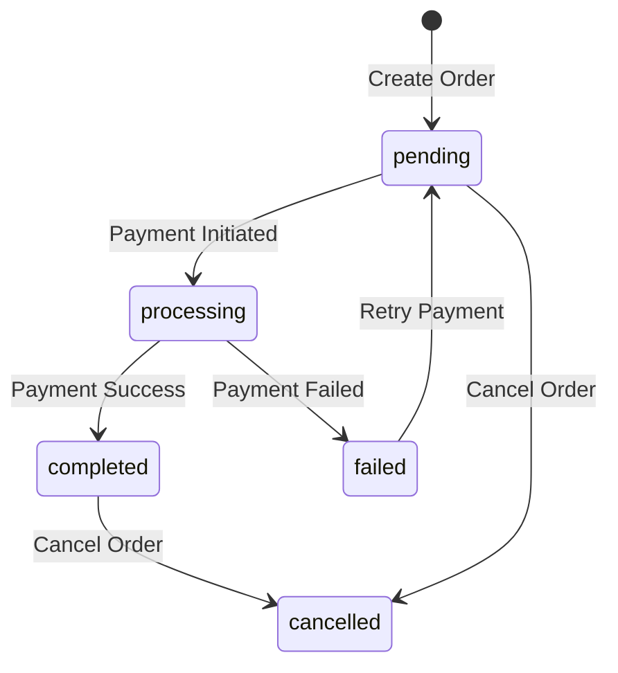

# Orders Module API Documentation

## Overview
Sistema completo de gestión de órdenes y carrito de compras.

**Base URL**: `/api/orders`

## Endpoints

### 1. List Orders
Obtener lista de órdenes del usuario autenticado.

**Endpoint**: `GET /api/orders/`
**Authentication**: Requerida (JWT)

#### Query Parameters
- `status`: Filter by status (pending, processing, completed, cancelled)
- `page`: Page number (default: 1)
- `limit`: Items per page (default: 10)
- `sort`: Sort field (created_at, total, status)
- `order`: Sort order (asc, desc)

#### Response (200 OK)
```json
{
  "orders": [
    {
      "id": 123,
      "order_number": "ORD-2024-00123",
      "status": "completed",
      "payment_status": "paid",
      "total": 290.00,
      "currency": "PEN",
      "items_count": 1,
      "created_at": "2024-01-01T00:00:00Z",
      "paid_at": "2024-01-01T00:30:00Z"
    }
  ],
  "total": 15,
  "page": 1,
  "pages": 2
}
```

---

### 2. Create Order
Crear una nueva orden desde el carrito actual.

**Endpoint**: `POST /api/orders/`
**Authentication**: Requerida (JWT)

#### Request Body
```json
{
  "billing_address": {
    "first_name": "Juan",
    "last_name": "Pérez",
    "address": "Av. Larco 1234",
    "city": "Lima",
    "state": "Lima",
    "zip_code": "15074",
    "country": "PE",
    "phone": "+51999999999"
  },
  "shipping_address": {
    // Opcional, si es diferente a billing
  },
  "coupon_code": "DESC10",  // Opcional
  "notes": "Entregar en la mañana",  // Opcional
  "payment_method": "card"  // card, bank_transfer, etc.
}
```

#### Response (201 Created)
```json
{
  "order": {
    "id": 123,
    "order_number": "ORD-2024-00123",
    "status": "pending",
    "payment_status": "pending",
    "items": [
      {
        "id": 1,
        "plan_id": 1,
        "plan_name": "Plan Standard",
        "template_id": 5,
        "template_name": "Elegante Dorado",
        "quantity": 1,
        "price": 290.00,
        "subtotal": 290.00
      }
    ],
    "subtotal": 290.00,
    "discount": 29.00,
    "tax": 0.00,
    "total": 261.00,
    "currency": "PEN",
    "coupon": {
      "code": "DESC10",
      "discount_type": "percentage",
      "discount_value": 10
    }
  },
  "payment_required": true,
  "payment_url": "/checkout/123"
}
```

---

### 3. Get Order Details
Obtener detalles completos de una orden específica.

**Endpoint**: `GET /api/orders/{order_id}`
**Authentication**: Requerida (JWT)

#### Response (200 OK)
```json
{
  "order": {
    "id": 123,
    "order_number": "ORD-2024-00123",
    "user": {
      "id": 1,
      "email": "user@example.com",
      "first_name": "Juan",
      "last_name": "Pérez"
    },
    "status": "completed",
    "payment_status": "paid",
    "payment_method": "card",
    "transaction_id": "TXN-ABC123",
    "items": [
      {
        "id": 1,
        "plan": {
          "id": 1,
          "name": "Plan Standard",
          "price": 290.00
        },
        "template": {
          "id": 5,
          "name": "Elegante Dorado",
          "preview_url": "/templates/5/preview"
        },
        "quantity": 1,
        "price": 290.00,
        "subtotal": 290.00
      }
    ],
    "billing_address": {
      "first_name": "Juan",
      "last_name": "Pérez",
      "address": "Av. Larco 1234",
      "city": "Lima"
    },
    "subtotal": 290.00,
    "discount": 0.00,
    "tax": 0.00,
    "total": 290.00,
    "currency": "PEN",
    "notes": null,
    "created_at": "2024-01-01T00:00:00Z",
    "paid_at": "2024-01-01T00:30:00Z",
    "completed_at": "2024-01-01T00:31:00Z"
  }
}
```

---

### 4. Get Order by Number
Buscar orden por número de orden.

**Endpoint**: `GET /api/orders/number/{order_number}`
**Authentication**: Requerida (JWT)

#### Response (200 OK)
```json
{
  "order": {
    "id": 123,
    "order_number": "ORD-2024-00123",
    // ... mismo formato que Get Order Details
  }
}
```

---

### 5. View Cart
Ver contenido actual del carrito.

**Endpoint**: `GET /api/orders/cart`
**Authentication**: Requerida (JWT)

#### Response (200 OK)
```json
{
  "cart": {
    "items": [
      {
        "id": 1,
        "plan": {
          "id": 1,
          "name": "Plan Standard",
          "price": 290.00,
          "features": ["RSVP", "Galería", "100 invitados"]
        },
        "template": {
          "id": 5,
          "name": "Elegante Dorado",
          "category": "elegant",
          "preview_url": "/templates/5/preview"
        },
        "quantity": 1,
        "price": 290.00,
        "subtotal": 290.00,
        "added_at": "2024-01-01T00:00:00Z"
      }
    ],
    "items_count": 1,
    "subtotal": 290.00,
    "estimated_tax": 0.00,
    "estimated_total": 290.00,
    "coupon": null,
    "discount": 0.00
  }
}
```

---

### 6. Add to Cart
Agregar item al carrito.

**Endpoint**: `POST /api/orders/cart/add`
**Authentication**: Requerida (JWT)

#### Request Body
```json
{
  "plan_id": 1,
  "template_id": 5,  // Opcional para plan exclusive
  "quantity": 1,
  "customization": {  // Opcional
    "primary_color": "#FF6B6B",
    "font_family": "Playfair Display"
  }
}
```

#### Response (200 OK)
```json
{
  "message": "Item added to cart",
  "cart": {
    "items": [
      {
        "id": 1,
        "plan_id": 1,
        "template_id": 5,
        "quantity": 1,
        "price": 290.00,
        "subtotal": 290.00
      }
    ],
    "items_count": 1,
    "subtotal": 290.00
  }
}
```

---

### 7. Remove from Cart
Quitar item del carrito.

**Endpoint**: `POST /api/orders/cart/remove`
**Authentication**: Requerida (JWT)

#### Request Body
```json
{
  "item_id": 1
}
```

#### Response (200 OK)
```json
{
  "message": "Item removed from cart",
  "cart": {
    "items": [],
    "items_count": 0,
    "subtotal": 0.00
  }
}
```

---

### 8. Update Cart Item
Actualizar cantidad de un item en el carrito.

**Endpoint**: `POST /api/orders/cart/update`
**Authentication**: Requerida (JWT)

#### Request Body
```json
{
  "item_id": 1,
  "quantity": 2
}
```

#### Response (200 OK)
```json
{
  "message": "Cart updated",
  "cart": {
    "items": [
      {
        "id": 1,
        "quantity": 2,
        "price": 290.00,
        "subtotal": 580.00
      }
    ],
    "items_count": 1,
    "subtotal": 580.00
  }
}
```

---

### 9. Clear Cart
Vaciar completamente el carrito.

**Endpoint**: `POST /api/orders/cart/clear`
**Authentication**: Requerida (JWT)

#### Response (200 OK)
```json
{
  "message": "Cart cleared",
  "cart": {
    "items": [],
    "items_count": 0,
    "subtotal": 0.00
  }
}
```

---

### 10. Calculate Cart Totals
Calcular totales del carrito con cupón y taxes.

**Endpoint**: `POST /api/orders/cart/calculate`
**Authentication**: Requerida (JWT)

#### Request Body
```json
{
  "coupon_code": "DESC10",  // Opcional
  "shipping_address": {  // Opcional, para calcular taxes
    "state": "Lima",
    "country": "PE"
  }
}
```

#### Response (200 OK)
```json
{
  "calculation": {
    "subtotal": 290.00,
    "discount": 29.00,
    "discount_percentage": 10,
    "tax": 0.00,
    "tax_rate": 0,
    "shipping": 0.00,
    "total": 261.00,
    "currency": "PEN",
    "coupon": {
      "code": "DESC10",
      "type": "percentage",
      "value": 10,
      "valid": true
    },
    "savings": 29.00
  }
}
```

## Order Status Flow



## Payment Status

| Status | Description | Next Actions |
|--------|-------------|--------------|
| `pending` | Esperando pago | Proceder al checkout |
| `processing` | Procesando pago | Esperar confirmación |
| `paid` | Pago completado | Orden completada |
| `failed` | Pago falló | Reintentar o cancelar |
| `refunded` | Reembolsado | N/A |

## Cart Rules

### Validaciones
- Solo un plan por carrito
- Template requerido para Plan Standard
- Template opcional para Plan Exclusive
- Cantidad mínima: 1
- Cantidad máxima: Definida por plan

### Persistencia
- Carrito persiste en base de datos
- Se mantiene entre sesiones
- Se limpia después de crear orden exitosa
- Timeout de 7 días sin actividad

## Error Responses

### 400 Bad Request
```json
{
  "error": "invalid_request",
  "message": "Invalid plan ID",
  "details": {
    "plan_id": "Plan not found"
  }
}
```

### 404 Not Found
```json
{
  "error": "not_found",
  "message": "Order not found"
}
```

### 409 Conflict
```json
{
  "error": "cart_conflict",
  "message": "Cart already contains a different plan"
}
```

### 422 Unprocessable Entity
```json
{
  "error": "validation_error",
  "message": "Coupon expired",
  "details": {
    "coupon": "Coupon DESC10 expired on 2023-12-31"
  }
}
```

## Integration Examples

### JavaScript/Axios
```javascript
// Add to cart
const addToCart = async (planId, templateId) => {
  const response = await api.post('/orders/cart/add', {
    plan_id: planId,
    template_id: templateId,
    quantity: 1
  });
  return response.data.cart;
};

// Create order from cart
const createOrder = async (billingInfo, couponCode) => {
  const response = await api.post('/orders/', {
    billing_address: billingInfo,
    coupon_code: couponCode,
    payment_method: 'card'
  });

  if (response.data.payment_required) {
    // Redirect to payment
    window.location.href = response.data.payment_url;
  }

  return response.data.order;
};

// Get order status
const checkOrderStatus = async (orderId) => {
  const response = await api.get(`/orders/${orderId}`);
  return response.data.order;
};
```

## Webhooks

El sistema puede notificar cambios de estado de orden via webhooks configurables:

### Order Completed
```json
{
  "event": "order.completed",
  "order": {
    "id": 123,
    "order_number": "ORD-2024-00123",
    "total": 290.00,
    "user_email": "user@example.com"
  },
  "timestamp": "2024-01-01T00:00:00Z"
}
```

### Order Cancelled
```json
{
  "event": "order.cancelled",
  "order": {
    "id": 123,
    "order_number": "ORD-2024-00123",
    "reason": "User requested"
  },
  "timestamp": "2024-01-01T00:00:00Z"
}
```