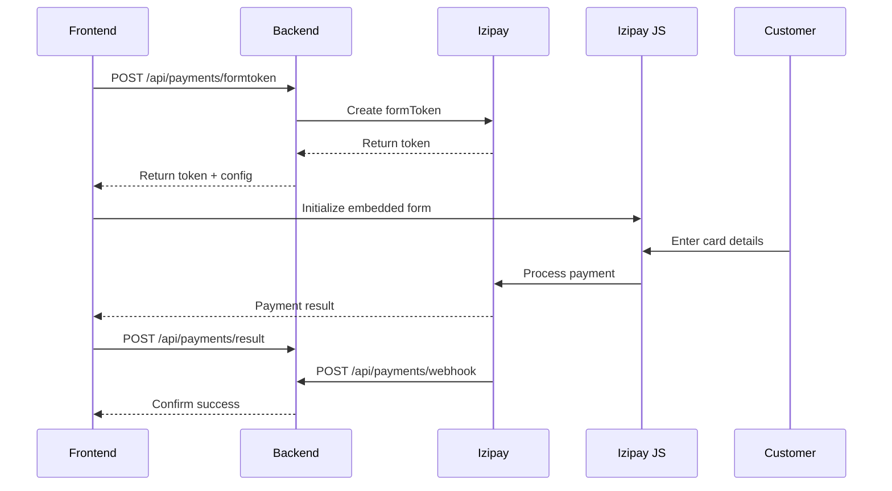

# Payments Module API Documentation

## Overview
Integración completa con el gateway de pagos Izipay para procesamiento de pagos con tarjeta.

**Base URL**: `/api/payments`

## Configuración Izipay

### Modos de Operación
- **SANDBOX**: Para pruebas y desarrollo
- **PRODUCTION**: Para transacciones reales

### Credenciales Requeridas
```env
IZIPAY_USERNAME=tu_usuario
IZIPAY_PASSWORD=tu_password
IZIPAY_PUBLIC_KEY=tu_clave_publica
IZIPAY_HMACSHA256=tu_clave_hmac
IZIPAY_MODE=SANDBOX
```

## Endpoints

### 1. Create Payment Form Token
Genera un token de formulario para inicializar el embedded form de Izipay.

**Endpoint**: `POST /api/payments/formtoken`
**Authentication**: Requerida (JWT)

#### Request Body
```json
{
  "order_id": 123,
  "amount": 29000,  // En centavos (S/ 290.00)
  "currency": "PEN",
  "order_number": "ORD-2024-00123",
  "customer": {
    "email": "cliente@example.com",
    "first_name": "Juan",
    "last_name": "Pérez",
    "phone": "+51999999999",
    "billing_address": {
      "address": "Av. Larco 1234",
      "city": "Lima",
      "state": "Lima",
      "zip_code": "15074",
      "country": "PE"
    }
  },
  "metadata": {
    "plan_id": 1,
    "plan_name": "Plan Standard",
    "coupon_code": "DESC10"
  }
}
```

#### Response (200 OK)
```json
{
  "formToken": "02e5b2c9-3e5a-4d8f-9c1a-7b8f4e3a2d1c",
  "publicKey": "73239078:testpublickey_...",
  "mode": "SANDBOX",
  "endpoint": "https://api.micuentaweb.pe",
  "expires_at": "2024-01-01T01:00:00Z"
}
```

#### Errors
- `400`: Datos inválidos o faltantes
- `404`: Orden no encontrada
- `500`: Error de comunicación con Izipay

---

### 2. Process Payment (Legacy)
Procesar pago directo (método legacy, usar formtoken preferiblemente).

**Endpoint**: `POST /api/payments/process-payment`
**Authentication**: Requerida (JWT)

#### Request Body
```json
{
  "order_id": 123,
  "card_number": "4111111111111111",
  "card_expiry": "12/25",
  "card_cvv": "123",
  "card_holder": "JUAN PEREZ"
}
```

#### Response (200 OK)
```json
{
  "success": true,
  "transaction_id": "TXN-2024-00001",
  "order_status": "completed",
  "message": "Payment processed successfully"
}
```

> ⚠️ **Nota**: Este endpoint es legacy. Usar embedded form con formtoken para PCI compliance.

---

### 3. Payment Webhook (IPN)
Recibe notificaciones instantáneas de pago desde Izipay.

**Endpoint**: `POST /api/payments/webhook`
**Authentication**: Validación por signature HMAC
**Headers**: `kr-hash`, `kr-hash-algorithm`, `kr-answer-type`

#### Request Body (desde Izipay)
```json
{
  "kr-hash": "7b8f4e3a2d1c02e5b2c9...",
  "kr-hash-algorithm": "sha256_hmac",
  "kr-answer": {
    "shopId": "73239078",
    "orderCycle": "CLOSED",
    "orderStatus": "PAID",
    "serverDate": "2024-01-01T00:00:00Z",
    "orderDetails": {
      "orderId": "ORD-2024-00123",
      "orderTotalAmount": 29000,
      "orderCurrency": "PEN"
    },
    "customer": {
      "billingDetails": {
        "email": "cliente@example.com"
      }
    },
    "transactions": [
      {
        "uuid": "abc123-def456",
        "status": "PAID",
        "amount": 29000,
        "currency": "PEN",
        "operationType": "DEBIT",
        "creationDate": "2024-01-01T00:00:00Z"
      }
    ]
  }
}
```

#### Response (200 OK)
```json
{
  "success": true,
  "message": "Webhook processed successfully",
  "order_status": "completed"
}
```

#### Validación de Signature
```python
# El webhook valida automáticamente usando:
expected_hash = hmac.new(
    IZIPAY_PASSWORD.encode('utf-8'),
    kr_answer.encode('utf-8'),
    hashlib.sha256
).hexdigest()

if expected_hash != received_hash:
    # Rechazar webhook
```

---

### 4. Payment Notification (Legacy)
Endpoint legacy para notificaciones IPN.

**Endpoint**: `POST /api/payments/notificacion`
**Authentication**: Validación por signature

> ⚠️ **Deprecado**: Usar `/api/payments/webhook` en su lugar.

---

### 5. Payment Result
Recibe resultado del pago desde el frontend después del embedded form.

**Endpoint**: `POST /api/payments/result`
**Authentication**: Requerida (JWT)

#### Request Body
```json
{
  "kr-hash": "signature_from_izipay",
  "kr-hash-algorithm": "sha256_hmac",
  "kr-answer": {
    "orderStatus": "PAID",
    "orderDetails": {
      "orderId": "ORD-2024-00123"
    },
    "transactions": [
      {
        "uuid": "transaction_uuid",
        "status": "PAID"
      }
    ]
  }
}
```

#### Response (200 OK)
```json
{
  "success": true,
  "order": {
    "id": 123,
    "order_number": "ORD-2024-00123",
    "status": "completed",
    "total": 290.00,
    "payment_status": "paid",
    "transaction_id": "transaction_uuid"
  },
  "redirect_url": "/mi-cuenta/ordenes/123"
}
```

---

### 6. Get Payment Status
Obtener estado de pago de una orden.

**Endpoint**: `GET /api/payments/status/{order_id}`
**Authentication**: Requerida (JWT)

#### Response (200 OK)
```json
{
  "order": {
    "id": 123,
    "order_number": "ORD-2024-00123",
    "status": "completed",
    "payment_status": "paid",
    "total": 290.00,
    "currency": "PEN"
  },
  "payment": {
    "status": "PAID",
    "transaction_id": "abc123-def456",
    "paid_at": "2024-01-01T00:00:00Z",
    "amount": 29000,
    "card_brand": "VISA",
    "card_last4": "1111"
  }
}
```

---

### 7. Get Izipay Configuration
Obtener configuración pública de Izipay para el frontend.

**Endpoint**: `GET /api/payments/config`
**Authentication**: No requerida

#### Response (200 OK)
```json
{
  "publicKey": "73239078:testpublickey_...",
  "mode": "SANDBOX",
  "endpoint": "https://api.micuentaweb.pe",
  "supportedCards": ["VISA", "MASTERCARD", "AMEX"],
  "currency": "PEN"
}
```

---

### 8. Get Izipay Order Status
Consultar estado directamente en Izipay.

**Endpoint**: `GET /api/payments/izipay/status/{order_number}`
**Authentication**: Requerida (JWT)

#### Response (200 OK)
```json
{
  "status": "success",
  "order": {
    "orderId": "ORD-2024-00123",
    "status": "PAID",
    "amount": 29000,
    "currency": "PEN",
    "creationDate": "2024-01-01T00:00:00Z"
  },
  "transaction": {
    "uuid": "abc123-def456",
    "status": "PAID",
    "amount": 29000,
    "operationType": "DEBIT",
    "card": {
      "brand": "VISA",
      "pan": "411111XXXXXX1111",
      "expiryMonth": 12,
      "expiryYear": 2025
      }
  }
}
```

---

### 9. Payment Health Check
Verificar conectividad con Izipay.

**Endpoint**: `GET /api/payments/health`
**Authentication**: No requerida

#### Response (200 OK)
```json
{
  "status": "healthy",
  "izipay": {
    "connected": true,
    "mode": "SANDBOX",
    "endpoint": "https://api.micuentaweb.pe"
  },
  "configuration": {
    "username_set": true,
    "password_set": true,
    "public_key_set": true,
    "hmac_key_set": true
  }
}
```

## Payment Flow

### 1. Embedded Form Flow (Recomendado)


### 2. Estados de Transacción

| Estado Izipay | Estado Orden | Descripción |
|--------------|--------------|-------------|
| `PAID` | `completed` | Pago exitoso |
| `RUNNING` | `processing` | Pago en proceso |
| `REFUSED` | `failed` | Pago rechazado |
| `CANCELLED` | `cancelled` | Pago cancelado |
| `ABANDONED` | `pending` | Pago abandonado |

## Tarjetas de Prueba (Sandbox)

### Tarjetas Exitosas
- **Visa**: `4970 1000 0000 0055`
- **Mastercard**: `5970 1000 0000 0063`
- **Amex**: `3710 0000 0000 0019`

### Tarjetas con Error
- **Fondos insuficientes**: `4970 1000 0000 0071`
- **Tarjeta expirada**: `4970 1000 0000 0089`
- **CVV incorrecto**: `4970 1000 0000 0097`

## Códigos de Error

### Errores de Validación
- `INVALID_AMOUNT`: Monto inválido o cero
- `INVALID_CURRENCY`: Moneda no soportada
- `MISSING_CUSTOMER`: Datos del cliente faltantes
- `ORDER_NOT_FOUND`: Orden no encontrada

### Errores de Pago
- `PAYMENT_REFUSED`: Pago rechazado por el banco
- `INSUFFICIENT_FUNDS`: Fondos insuficientes
- `CARD_EXPIRED`: Tarjeta expirada
- `INVALID_CVV`: CVV incorrecto
- `FRAUD_SUSPECTED`: Sospecha de fraude

### Errores de Sistema
- `IZIPAY_CONNECTION_ERROR`: Error conectando con Izipay
- `INVALID_SIGNATURE`: Firma del webhook inválida
- `CONFIGURATION_ERROR`: Error en configuración

## Seguridad

### PCI Compliance
- **NO** almacenar datos de tarjeta en el backend
- Usar siempre embedded form para entrada de tarjeta
- Validar todas las signatures de webhooks

### Webhook Security
```python
# Validación de webhook signature
import hmac
import hashlib

def validate_webhook(kr_hash, kr_answer, password):
    expected = hmac.new(
        password.encode('utf-8'),
        kr_answer.encode('utf-8'),
        hashlib.sha256
    ).hexdigest()
    return hmac.compare_digest(expected, kr_hash)
```

### Rate Limiting
- Máximo 100 requests por minuto por IP
- Webhooks no tienen límite

## Integración Frontend

### Instalación
```bash
npm install @lyracom/embedded-form-glue
```

### Ejemplo de Uso
```javascript
import KRGlue from '@lyracom/embedded-form-glue';

// Obtener token
const response = await fetch('/api/payments/formtoken', {
  method: 'POST',
  headers: {
    'Content-Type': 'application/json',
    'Authorization': `Bearer ${token}`
  },
  body: JSON.stringify({
    order_id: 123,
    amount: 29000,
    currency: 'PEN'
  })
});

const { formToken, publicKey, endpoint } = await response.json();

// Inicializar embedded form
const { KR } = await KRGlue.loadLibrary(
  endpoint,
  publicKey
);

await KR.setFormConfig({
  formToken: formToken,
  'kr-language': 'es-ES'
});

// Renderizar formulario
await KR.renderElements('#payment-form');

// Manejar resultado
KR.onSubmit(async (response) => {
  if (response.clientAnswer.orderStatus === 'PAID') {
    // Enviar resultado al backend
    await fetch('/api/payments/result', {
      method: 'POST',
      body: JSON.stringify(response)
    });
  }
});
```

## Monitoreo y Logs

### Logs Importantes
- Todas las transacciones se registran en `payment_logs`
- Webhooks se registran en `webhook_logs`
- Errores se registran en `payment_errors`

### Métricas
- Tasa de conversión de pagos
- Tiempo promedio de procesamiento
- Tipos de error más comunes
- Métodos de pago más usados