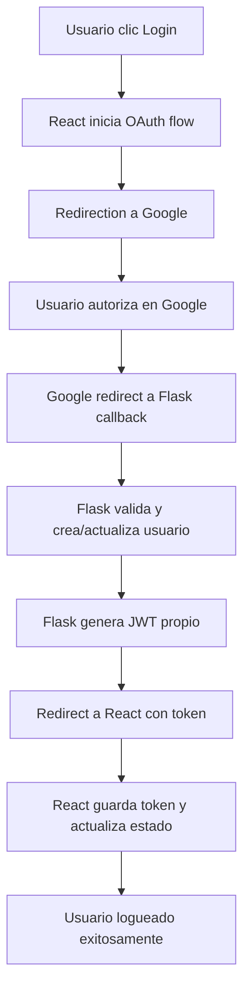

# 🔑 Autenticación Google OAuth con Flask + React

Guía completa para implementar **Login con Google** en el proyecto de invitaciones web usando **Flask-Dance** en el backend y **React OAuth** en el frontend.

## 📋 Tabla de Contenidos

- [Requisitos Previos](#requisitos-previos)
- [Configuración Google Cloud Console](#configuración-google-cloud-console)
- [Backend Flask con Flask-Dance](#backend-flask-con-flask-dance)
- [Frontend React con Google OAuth](#frontend-react-con-google-oauth)
- [Integración Completa](#integración-completa)
- [Testing y Deployment](#testing-y-deployment)
- [Referencias](#referencias)

---

## 🔧 Requisitos Previos

- **Python 3.10+** (ya instalado en el proyecto)
- **Node.js 18+** (para el frontend React)
- **Cuenta Google** para credenciales OAuth
- **Base de datos** configurada (PostgreSQL/MySQL en prod, SQLite para testing)
- **Repositorio flask-dance** clonado como referencia

```bash
# Clonar repositorio de referencia
git clone https://github.com/singingwolfboy/flask-dance
```

---

## 🔐 Configuración Google Cloud Console

### 1. Crear Proyecto
1. Ir a [Google Cloud Console](https://console.cloud.google.com/)
2. Crear proyecto nuevo: `invitaciones-web-oauth`
3. Habilitar **Google Identity Services (OAuth 2.0)**
   - ⚠️ **NO usar Google+ API** (deprecated desde 2019)
   - Solo necesitas: OAuth 2.0 Client IDs

### 2. Configurar OAuth Consent Screen
```
- Tipo: External
- Nombre de la aplicación: "Invitaciones Web"
- Email de soporte: tu-email@dominio.com
- Scopes autorizados:
  * email
  * profile
  * openid
- Dominio autorizado: localhost (para desarrollo)
```

### 3. Crear Credenciales OAuth 2.0

⚠️ **IMPORTANTE: Los endpoints deben coincidir EXACTAMENTE con tu configuración de producción**

```
- Tipo: Web Application
- Nombre: "Invitaciones Web Client"
- JavaScript origins (OBLIGATORIOS):
  * http://localhost:3000 (desarrollo local React)
  * https://invitaciones-web-ten.vercel.app (producción en Vercel)

- Redirect URIs (OBLIGATORIOS):
  * http://localhost:5000/api/auth/google/callback (desarrollo local Flask)
  * https://invitaciones-web-za3f.onrender.com/api/auth/google/callback (producción en Render)
```

#### ⚠️ Configuración CRÍTICA para Producción

En **Google Cloud Console → Credentials → OAuth client**:

1. **Edita tu OAuth Client** (o crea uno nuevo si es necesario)

2. **JavaScript origins** - Añade EXACTAMENTE:
   ```
   https://invitaciones-web-ten.vercel.app
   ```
   ⚠️ Sin trailing slash `/` al final
   ⚠️ Debe coincidir con tu dominio de Vercel

3. **Redirect URIs** - Añade EXACTAMENTE:
   ```
   https://invitaciones-web-za3f.onrender.com/api/auth/google/callback
   ```
   ⚠️ El path debe coincidir con tu endpoint en Flask
   ⚠️ Verifica que tu backend en Render maneje esta ruta

4. **Verificación del Client ID**:
   - En React, usa EXACTAMENTE el `clientId` que Google te proporcionó
   - NO uses un Client ID de otro proyecto o ambiente
   - Ejemplo: `123456789-abcdefg.apps.googleusercontent.com`

5. **Validación en Flask**:
   - El backend DEBE manejar la ruta `/api/auth/google/callback`
   - DEBE validar el token/código recibido de Google
   - DEBE verificar que el `client_id` coincida

### 4. Guardar Credenciales

⚠️ **IMPORTANTE: Variables de entorno específicas del proyecto**

**Frontend (.env.local)**:
```bash
REACT_APP_GOOGLE_CLIENT_ID=tu_client_id
```

**Backend (.env)**:
```bash
GOOGLE_CLIENT_ID=tu_client_id
GOOGLE_CLIENT_SECRET=tu_client_secret
FLASK_SECRET=clave_segura
```

#### 🔒 Generación Segura de FLASK_SECRET

⚠️ **CRÍTICO**: NO uses claves débiles como "12345" o "password"

```python
# Generar clave segura (ejecutar en terminal Python)
import secrets
print(secrets.token_hex(32))
# Resultado: 'a1b2c3d4e5f6...64_caracteres_aleatorios'
```

O desde terminal:
```bash
python -c "import secrets; print(secrets.token_hex(32))"
```

---

## 🖥️ Backend Flask con Flask-Dance

### 1. Instalación de Dependencias

```bash
cd backend
pip install flask-dance[sqla] google-auth PyJWT
```

### 2. Configuración en `app.py`

```python
from flask import Flask, jsonify, request
from flask_dance.contrib.google import make_google_blueprint, google
from flask_sqlalchemy import SQLAlchemy
from flask_cors import CORS
import jwt
import datetime
import os

app = Flask(__name__)
CORS(app)

# Configuración OAuth
app.config['SECRET_KEY'] = os.getenv('FLASK_SECRET', 'dev-secret-key')
app.config['GOOGLE_OAUTH_CLIENT_ID'] = os.getenv('GOOGLE_CLIENT_ID')
app.config['GOOGLE_OAUTH_CLIENT_SECRET'] = os.getenv('GOOGLE_CLIENT_SECRET')

# Database ya configurada
from models.user import User, db

# Blueprint de Google OAuth - Ruta unificada
google_bp = make_google_blueprint(
    scope=["openid", "email", "profile"],
    redirect_to="google_authorized",
    authorized_url="/api/auth/google/callback"  # Ruta oficial unificada
)
app.register_blueprint(google_bp, url_prefix="/api/auth")
```

### 3. Modelo de Usuario OAuth

```python
# En models/oauth.py
from flask_sqlalchemy import SQLAlchemy
from flask_dance.consumer.storage.sqla import OAuthConsumerMixin

class OAuth(OAuthConsumerMixin, db.Model):
    __tablename__ = 'oauth'

    provider_user_id = db.Column(db.String(256), unique=True, nullable=False)
    user_id = db.Column(db.Integer, db.ForeignKey('users.id'), nullable=False)
    user = db.relationship('User')
```

### 4. Endpoints de Autenticación

```python
# En api/auth.py
from flask import Blueprint, jsonify, redirect, url_for, session
from flask_dance.contrib.google import google
from models.user import User
from models.oauth import OAuth
import jwt
import datetime

auth_bp = Blueprint('auth', __name__)

@auth_bp.route('/google/callback')
def google_authorized():
    """Callback después del OAuth dance"""
    if not google.authorized:
        return jsonify({'error': 'Failed to log in with Google'}), 400

    # Obtener info del usuario de Google
    resp = google.get("/oauth2/v2/userinfo")
    if not resp.ok:
        return jsonify({'error': 'Failed to fetch user info'}), 400

    info = resp.json()
    google_user_id = str(info["id"])

    # Buscar OAuth existente
    oauth = OAuth.query.filter_by(
        provider="google",
        provider_user_id=google_user_id,
    ).first()

    if oauth:
        # Usuario existente
        user = oauth.user
    else:
        # Crear nuevo usuario
        user = User(
            email=info["email"],
            name=info["name"],
            profile_picture=info.get("picture"),
            provider="google"
        )
        db.session.add(user)
        db.session.flush()

        # Crear registro OAuth
        oauth = OAuth(
            provider="google",
            provider_user_id=google_user_id,
            user=user,
        )
        db.session.add(oauth)
        db.session.commit()

    # Generar JWT propio
    payload = {
        'user_id': user.id,
        'email': user.email,
        'name': user.name,
        'exp': datetime.datetime.utcnow() + datetime.timedelta(hours=24)
    }
    token = jwt.encode(payload, app.config['FLASK_SECRET'], algorithm='HS256')

    # Redirigir al frontend con token
    return redirect(f"http://localhost:3000/auth/callback?token={token}")

@auth_bp.route('/google/login')
def google_login():
    """Endpoint para iniciar OAuth flow"""
    return redirect(url_for("google.login"))

@auth_bp.route('/google/verify', methods=['POST'])
def verify_google_token():
    """Verificar Google ID Token desde el frontend"""
    credential = request.json.get('credential')

    if not credential:
        return jsonify({'error': 'No credential provided'}), 400

    try:
        # ⚠️ CRÍTICO: Validar token con Google (NO confiar en el cliente)
        from google.oauth2 import id_token
        from google.auth.transport import requests as google_requests

        idinfo = id_token.verify_oauth2_token(
            credential,
            google_requests.Request(),
            app.config['GOOGLE_CLIENT_ID']
        )

        # Verificar que el token es para nuestra app
        if idinfo['iss'] not in ['accounts.google.com', 'https://accounts.google.com']:
            raise ValueError('Wrong issuer.')

        # Procesar usuario (mismo código que google_authorized)
        google_user_id = str(idinfo["sub"])
        email = idinfo["email"]
        name = idinfo["name"]
        picture = idinfo.get("picture")

        # Buscar o crear usuario...
        # [Mismo código de creación/búsqueda de usuario]

        # Generar JWT propio
        payload = {
            'user_id': user.id,
            'email': email,
            'name': name,
            'exp': datetime.datetime.utcnow() + datetime.timedelta(hours=24)
        }
        token = jwt.encode(payload, app.config['FLASK_SECRET'], algorithm='HS256')

        return jsonify({'token': token, 'user': {'name': name, 'email': email}})

    except ValueError as e:
        return jsonify({'error': f'Invalid token: {str(e)}'}), 401
    except Exception as e:
        return jsonify({'error': f'Token verification failed: {str(e)}'}), 401

@auth_bp.route('/verify', methods=['POST'])
def verify_jwt_token():
    """Verificar JWT token propio desde el frontend"""
    token = request.json.get('token')

    try:
        payload = jwt.decode(token, app.config['FLASK_SECRET'], algorithms=['HS256'])
        user = User.query.get(payload['user_id'])

        return jsonify({
            'valid': True,
            'user': {
                'id': user.id,
                'email': user.email,
                'name': user.name,
                'profile_picture': user.profile_picture
            }
        })
    except jwt.ExpiredSignatureError:
        return jsonify({'valid': False, 'error': 'Token expired'}), 401
    except jwt.InvalidTokenError:
        return jsonify({'valid': False, 'error': 'Invalid token'}), 401
```

### 5. Storage Configuration

```python
# Configurar almacenamiento de tokens
from flask_dance.consumer.storage.sqla import SQLAlchemyStorage

google_bp.storage = SQLAlchemyStorage(OAuth, db.session, user=lambda: current_user)
```

---

## 🎨 Frontend React con Google OAuth

### 1. Instalación de Dependencias

```bash
cd frontend
npm install @react-oauth/google jwt-decode
```

### 2. Configuración del Provider

```jsx
// En src/components/auth/GoogleAuthProvider.tsx
import { GoogleOAuthProvider } from '@react-oauth/google';
import { ReactNode } from 'react';

interface GoogleAuthProviderProps {
  children: ReactNode;
}

export const GoogleAuthProvider: React.FC<GoogleAuthProviderProps> = ({ children }) => {
  const clientId = process.env.REACT_APP_GOOGLE_CLIENT_ID!;

  return (
    <GoogleOAuthProvider clientId={clientId}>
      {children}
    </GoogleOAuthProvider>
  );
};
```

### 3. Componente de Login

```jsx
// En src/components/auth/GoogleLoginButton.tsx
import { GoogleLogin } from '@react-oauth/google';
import { useAuth } from '@/lib/hooks/useAuth';

export const GoogleLoginButton: React.FC = () => {
  const { loginWithGoogle } = useAuth();

  return (
    <GoogleLogin
      onSuccess={(credentialResponse) => {
        if (credentialResponse.credential) {
          loginWithGoogle(credentialResponse.credential);
        }
      }}
      onError={() => {
        console.error('Google Login failed');
      }}
      size="large"
      text="signin_with"
      shape="rectangular"
      theme="outline"
    />
  );
};
```

### 4. Hook de Autenticación

```tsx
// En src/lib/hooks/useAuth.ts
import { create } from 'zustand';
import { persist } from 'zustand/middleware';
import { jwtDecode } from 'jwt-decode';

interface User {
  id: number;
  email: string;
  name: string;
  profile_picture?: string;
}

interface AuthStore {
  user: User | null;
  token: string | null;
  isAuthenticated: boolean;
  login: (token: string) => void;
  logout: () => void;
  loginWithGoogle: (credential: string) => Promise<void>;
}

export const useAuth = create<AuthStore>()(
  persist(
    (set, get) => ({
      user: null,
      token: null,
      isAuthenticated: false,

      login: (token: string) => {
        try {
          const decoded = jwtDecode<any>(token);
          set({
            token,
            user: {
              id: decoded.user_id,
              email: decoded.email,
              name: decoded.name
            },
            isAuthenticated: true
          });
        } catch (error) {
          console.error('Invalid token:', error);
        }
      },

      logout: () => {
        set({
          user: null,
          token: null,
          isAuthenticated: false
        });
      },

      loginWithGoogle: async (credential: string) => {
        try {
          // ⚠️ SEGURIDAD: Siempre validar tokens en el backend
          // NO confiar en tokens del cliente sin validación

          // Opción 1: Enviar credential a Flask para validación (RECOMENDADO)
          const response = await fetch('/api/auth/google/verify', {
            method: 'POST',
            headers: { 'Content-Type': 'application/json' },
            body: JSON.stringify({ credential })
          });

          if (!response.ok) {
            throw new Error('Token validation failed');
          }

          const data = await response.json();
          if (data.token) {
            get().login(data.token);
          }

          // Opción 2: Iniciar OAuth flow en Flask (alternativa)
          // window.location.href = '/api/auth/google/login';
        } catch (error) {
          console.error('Google login error:', error);
          // Manejar error en UI
        }
      }
    }),
    {
      name: 'auth-storage'
    }
  )
);
```

### 5. Página de Callback

```tsx
// En src/app/auth/callback/page.tsx
'use client';

import { useEffect } from 'react';
import { useRouter, useSearchParams } from 'next/navigation';
import { useAuth } from '@/lib/hooks/useAuth';

export default function AuthCallback() {
  const router = useRouter();
  const searchParams = useSearchParams();
  const { login } = useAuth();

  useEffect(() => {
    const token = searchParams.get('token');

    if (token) {
      login(token);
      router.push('/dashboard'); // Redirigir después del login
    } else {
      router.push('/login?error=auth_failed');
    }
  }, [searchParams, login, router]);

  return (
    <div className="flex items-center justify-center min-h-screen">
      <div className="animate-spin rounded-full h-8 w-8 border-b-2 border-purple-600"></div>
      <span className="ml-2">Completando autenticación...</span>
    </div>
  );
}
```

---

## 🔗 Integración Completa

### 1. Variables de Entorno

⚠️ **Variables específicas del proyecto**

```bash
# Backend (.env)
GOOGLE_CLIENT_ID=tu_client_id
GOOGLE_CLIENT_SECRET=tu_client_secret
FLASK_SECRET=clave_segura

# Frontend (.env.local)
REACT_APP_GOOGLE_CLIENT_ID=tu_client_id
NEXT_PUBLIC_API_URL=http://localhost:5000
```

### 2. Configuración del App Root

```jsx
// En src/app/layout.tsx
import { GoogleAuthProvider } from '@/components/auth/GoogleAuthProvider';

export default function RootLayout({
  children,
}: {
  children: React.ReactNode;
}) {
  return (
    <html lang="es">
      <body>
        <GoogleAuthProvider>
          {children}
        </GoogleAuthProvider>
      </body>
    </html>
  );
}
```

### 3. Middleware de Autenticación

```tsx
// En src/middleware.ts
import { NextResponse } from 'next/server';
import type { NextRequest } from 'next/server';

export function middleware(request: NextRequest) {
  const token = request.cookies.get('auth-token')?.value;

  // Rutas protegidas
  if (request.nextUrl.pathname.startsWith('/dashboard')) {
    if (!token) {
      return NextResponse.redirect(new URL('/login', request.url));
    }
  }

  return NextResponse.next();
}

export const config = {
  matcher: ['/dashboard/:path*', '/admin/:path*']
};
```

---

## 🧪 Testing y Deployment

### 1. Testing Local

```bash
# Terminal 1: Backend
cd backend
python app.py

# Terminal 2: Frontend
cd frontend
npm run dev

# Probar flujo:
# 1. Ir a http://localhost:3000/login
# 2. Clic en "Login con Google"
# 3. Completar OAuth en Google
# 4. Verificar redirection a /dashboard con usuario logueado
```

### 2. Checklist de Producción

- [ ] **Credenciales Google** configuradas para dominio de producción
  - [ ] JavaScript origin: `https://invitaciones-web-ten.vercel.app`
  - [ ] Redirect URI: `https://invitaciones-web-za3f.onrender.com/api/auth/google/callback`
- [ ] **HTTPS** habilitado (requerido por Google OAuth)
- [ ] **Variables de entorno** configuradas en servidor
  - [ ] Vercel: `REACT_APP_GOOGLE_CLIENT_ID`
  - [ ] Render: `GOOGLE_CLIENT_ID`, `GOOGLE_CLIENT_SECRET` y `FLASK_SECRET`
- [ ] **Base de datos** migrada con tablas `oauth`
- [ ] **CORS** configurado para permitir origen de Vercel
- [ ] **JWT Secret** seguro en producción
- [ ] **Logs** configurados para debugging OAuth
- [ ] **Endpoints verificados** en Google Console y código

### 3. Comandos de Deploy

```bash
# Migración de BD
cd backend
flask db upgrade

# Build del frontend
cd frontend
npm run build

# Variables de entorno de producción
export GOOGLE_CLIENT_ID=prod-client-id
export GOOGLE_CLIENT_SECRET=prod-client-secret
export FLASK_SECRET=secure-jwt-secret-key
```

### 4. Verificación de Google App para Producción

⚠️ **Para usuarios públicos (no solo test users)**

Actualmente tu app está en **Testing Status**. Para producción real:

#### Pasar a "In Production"
1. **Google Cloud Console → OAuth Consent Screen**
2. **Publishing Status: In Production**
3. **Requisitos obligatorios**:
   - ✅ **Privacy Policy URL**: `https://tu-dominio.com/privacy`
   - ✅ **Terms of Service URL**: `https://tu-dominio.com/terms`
   - ✅ **Authorized domains** verificados en Google Search Console
   - ✅ **App logo** y screenshots de la app

#### Verificación de Dominios
```bash
# En Google Search Console (https://search.google.com/search-console)
1. Agregar propiedad: https://invitaciones-web-ten.vercel.app
2. Verificar propiedad (DNS, HTML file, o Google Analytics)
3. Volver a Google Cloud Console → OAuth Consent Screen
4. Agregar dominio verificado en "Authorized domains"
```

#### Límites por Status
- **Testing**: Máximo 100 usuarios de prueba
- **In Production**: Usuarios ilimitados, pero requiere verificación de Google

---

## 📚 Referencias

### Documentación Oficial
- [Flask-Dance Docs](http://flask-dance.readthedocs.io/)
- [Google OAuth 2.0](https://developers.google.com/identity/protocols/oauth2)
- [React OAuth Google](https://github.com/MomenSherif/react-oauth)

### Repositorios de Referencia
- [Flask-Dance GitHub](https://github.com/singingwolfboy/flask-dance) (clonado localmente)
- [Flask-Dance Examples](https://github.com/singingwolfboy/flask-dance/tree/main/example)
- [Google OAuth Setup Guide](https://flask-dance.readthedocs.io/en/latest/providers.html#google)

### Ejemplos del Proyecto
```
docs/login/google login/flask-dance/
├── flask_dance/contrib/google.py     # Implementación Google OAuth
├── example/                          # Ejemplos de integración
└── docs/                            # Documentación completa
```

### Arquitectura de Flujo



---

## ⚡ Troubleshooting

### 🚨 **ERRORES CRÍTICOS MÁS COMUNES**

#### 1. **"redirect_uri_mismatch"** ⚠️ **MÁS COMÚN**

**❌ Problema**: URLs no coinciden exactamente entre:
- Google Console configuration
- Flask-Dance blueprint
- Variables de entorno (.env)

**✅ Verificación completa**:
```bash
# 1. Google Console debe tener EXACTAMENTE:
http://localhost:5000/api/auth/google/callback          # Desarrollo
https://invitaciones-web-za3f.onrender.com/api/auth/google/callback  # Producción

# 2. .env debe tener:
GOOGLE_REDIRECT_URI_DEV=http://localhost:5000/api/auth/google/callback
GOOGLE_REDIRECT_URI_PROD=https://invitaciones-web-za3f.onrender.com/api/auth/google/callback

# 3. Flask-Dance en app.py debe usar:
authorized_url="/api/auth/google/callback"
url_prefix="/api/auth"
```

**⚠️ Validación**: NO trailing slash, NO mayúsculas, NO espacios extra

#### 2. **CORS Configuration** ⚠️ **CRÍTICO PARA PRODUCCIÓN**

**❌ Problema**: Frontend no puede conectar con backend

**✅ Solución**:
```bash
# .env debe incluir TODOS los orígenes:
CORS_ORIGIN=http://localhost:3000,http://localhost:3001,https://invitaciones-web-ten.vercel.app

# app.py debe usar:
cors_origins = os.getenv('CORS_ORIGIN', 'http://localhost:3000').split(',')
CORS(app, origins=cors_origins, supports_credentials=True)
```

#### 3. **Variables de Entorno Mismatch**

**❌ Problema**: Diferentes configuraciones entre desarrollo/producción

**✅ Estructura requerida**:
```bash
# Google OAuth
GOOGLE_CLIENT_ID=tu_client_id_real
GOOGLE_CLIENT_SECRET=tu_client_secret_real

# URLs por ambiente
GOOGLE_REDIRECT_URI_DEV=http://localhost:5000/api/auth/google/callback
GOOGLE_REDIRECT_URI_PROD=https://invitaciones-web-za3f.onrender.com/api/auth/google/callback

# Frontend URLs
FRONTEND_URL_DEV=http://localhost:3000
FRONTEND_URL_PROD=https://invitaciones-web-ten.vercel.app

# Ambiente actual
APP_ENVIRONMENT=development  # Cambiar a 'production' en servidor
```

### Errores Comunes Adicionales

4. **"invalid_client"**
   - Verificar CLIENT_ID coincida exactamente con el de Google Console
   - Confirmar que usas el CLIENT_ID correcto (no de otro proyecto)
   - Verificar CLIENT_SECRET en variables de entorno

5. **"origin_mismatch"**
   - JavaScript origin debe ser `https://invitaciones-web-ten.vercel.app`
   - Sin trailing slash al final
   - Debe coincidir con el dominio de Vercel

6. **JWT Token Invalid**
   - Verificar FLASK_SECRET es el mismo en encode/decode
   - Confirmar formato de token en Authorization header

7. **Endpoints no encontrados**
   - Verificar que Flask maneja `/api/auth/google/callback`
   - Confirmar que la ruta está registrada en el Blueprint

### 🔍 **Checklist de Verificación Pre-Deploy**

#### Desarrollo Local:
- [ ] Backend funciona en `http://localhost:5000`
- [ ] Frontend funciona en `http://localhost:3000`
- [ ] Redirect a Google funciona: `curl http://localhost:5000/api/auth/google/login`
- [ ] CORS permite requests: `curl http://localhost:5000/health`
- [ ] Variables `.env` configuradas correctamente

#### Producción:
- [ ] URLs en Google Console coinciden exactamente
- [ ] CORS incluye dominio de Vercel
- [ ] Variables de entorno en Render configuradas
- [ ] `APP_ENVIRONMENT=production` en servidor
- [ ] Callback URL responde: `https://invitaciones-web-za3f.onrender.com/api/auth/google/callback`

### 🛠️ **Comandos de Debug**

```bash
# Verificar endpoints locales
curl http://localhost:5000/
curl http://localhost:5000/health
curl http://localhost:5000/api/auth/google/login

# Test de token verification
curl -X POST http://localhost:5000/api/auth/google/verify \
  -H "Content-Type: application/json" \
  -d '{"credential": "invalid_token"}'

# Verificar CORS desde frontend
fetch('http://localhost:5000/health')
  .then(r => r.json())
  .then(console.log)
```

### Debug Tips

```python
# Backend debugging
import logging
logging.basicConfig(level=logging.DEBUG)

# Frontend debugging
console.log('Auth state:', useAuth.getState());
```

---

## 🚀 **CHECKLIST CRÍTICO DE IMPLEMENTACIÓN FRONTEND**

### ⚠️ **Cosas que revisaría / reforzaría**

#### 1. **Callback de éxito en frontend**

Después de guardar el JWT en el store, asegúrate de redirigir al dashboard o página protegida.

```jsx
// Ejemplo en AuthModal o GoogleLoginButton:
const handleAuthSuccess = () => {
  if (isAuthenticated) {
    router.push('/dashboard'); // o '/mi-cuenta'
  }
  onSuccess?.(); // Callback opcional
  onClose(); // Cerrar modal
};
```

**⚠️ Crítico**: Sin redirection, el usuario se queda en la página de login aunque esté autenticado.

#### 2. **Persistencia de tokens**

Verifica si tu store Zustand ya está con `persist`. Si no, los usuarios se desloguean al refrescar la página.

```tsx
// Verificar que useAuthStore tenga persist configurado:
export const useAuthStore = create<AuthState>()(
  persist(
    (set, get) => ({
      // ... estado de auth
    }),
    {
      name: 'auth-storage', // Clave en localStorage
      partialize: (state) => ({
        accessToken: state.accessToken,
        refreshToken: state.refreshToken,
        user: state.user
      }),
    }
  )
);
```

**⚠️ Crítico**: También evalúa si guardas el token en `localStorage` o `cookie httpOnly` (más seguro para producción).

#### 3. **Logout completo**

Además de `logout()` en Zustand, podrías llamar al endpoint `/api/auth/google/revoke` para invalidar tokens en Google.

```tsx
const handleLogout = async () => {
  try {
    // 1. Revoke Google tokens
    await authApi.revokeGoogleAuth();

    // 2. Clear local state
    logout(false);

    // 3. Redirect
    router.push('/');

    toast.success('Sesión cerrada correctamente');
  } catch (error) {
    // Still logout locally even if revoke fails
    logout(false);
    router.push('/');
  }
};
```

#### 4. **Manejo de errores en UI**

Ya tienes mensajes amigables, pero valida que aparezcan en el modal (no solo en consola).

```tsx
// Ejemplo de error handling robusto:
const googleAuthMutation = useMutation({
  mutationFn: async (credential: string) => {
    const response = await authApi.verifyGoogleToken({ credential });
    return response;
  },
  onError: (error: any) => {
    const errorMessage = error.response?.data?.message ||
      'Tu sesión con Google no pudo completarse, inténtalo de nuevo.';

    // Mostrar en UI (modal)
    setError(errorMessage);

    // Mostrar toast
    toast.error(errorMessage);

    // Log for debugging
    console.error('Google OAuth error:', error);
  },
});
```

#### 5. **Scopes**

Revisar que los scopes en frontend/backend sean los mismos: `["openid", "email", "profile"]`.

```python
# Backend: Flask-Dance blueprint
google_bp = make_google_blueprint(
    scope=["openid", "email", "profile"],  # ⚠️ Debe coincidir
    redirect_to="auth.google_authorized"
)
```

```jsx
// Frontend: GoogleLogin component
// Los scopes son automáticos, pero verificar que el backend los maneje
```

**⚠️ Crítico**: Si alguno no coincide, puede dar `invalid_scope`.

#### 6. **Environment Variables limpias**

Asegúrate de que solo tengas las variables necesarias y con nombres correctos:

```bash
# Frontend (.env.local) - SOLO ESTAS:
NEXT_PUBLIC_GOOGLE_CLIENT_ID=1076021223403-tnqi2ibpho99m0lt621em1mcj6o2nt9q.apps.googleusercontent.com
NEXT_PUBLIC_API_URL=http://localhost:5000/api

# Backend (.env) - SOLO ESTAS:
GOOGLE_CLIENT_ID=1076021223403-tnqi2ibpho99m0lt621em1mcj6o2nt9q.apps.googleusercontent.com
GOOGLE_CLIENT_SECRET=tu_client_secret_real
```

**⚠️ Crítico**:
- Nada de secrets del backend en el frontend
- Usar `NEXT_PUBLIC_` para variables del frontend
- No mezclar prefijos (`REACT_APP_` vs `NEXT_PUBLIC_`)

#### 7. **CORS Configuration actualizada**

```bash
# Backend (.env) - Incluir puerto 3001:
CORS_ORIGIN=http://localhost:3000,http://localhost:3001,https://invitaciones-web-ten.vercel.app
```

---

## 🚀 **CHECKLIST FINAL PARA PRUEBAS**

### ✅ **Pre-testing checklist**

- [ ] **Login con Google funciona en** `http://localhost:3001/login`
- [ ] **Después de loguear, me manda al dashboard** con mi usuario cargado
- [ ] **Si cierro sesión, elimina el token** y hace revoke en Google
- [ ] **Si refresco la página, sigo logueado** (persistencia funcionando)
- [ ] **Errores aparecen en pantalla** (no solo en consola)
- [ ] **En producción, los dominios** de Vercel/Render están en Google Console

### ✅ **Testing Flow Completo**

```bash
# 1. Iniciar servicios
cd backend && python app.py    # Puerto 5000
cd frontend && npm run dev     # Puerto 3001

# 2. Probar flujo manual:
# - Ir a http://localhost:3001
# - Buscar AuthModal (login/register)
# - Click en "Iniciar sesión con Google"
# - Completar OAuth en Google
# - Verificar redirection a dashboard
# - Verificar usuario en estado de auth
# - Probar logout completo
# - Probar refresh de página (persistencia)
```

### ⚠️ **Errores comunes a verificar**

1. **Modal no aparece**: Verificar que GoogleAuthProvider esté en providers
2. **Button no responde**: Client ID mal configurado en .env
3. **Backend error 500**: Variables de entorno faltantes en backend
4. **CORS error**: Frontend/backend en puertos diferentes sin CORS config
5. **No redirect después de login**: Falta lógica de redirection en success callback
6. **Logout incompleto**: No se limpia el store o no se revoca en Google

### 🔧 **Debug Commands**

```bash
# Verificar Google Client ID cargado
console.log(process.env.NEXT_PUBLIC_GOOGLE_CLIENT_ID);

# Verificar estado de auth
console.log(useAuthStore.getState());

# Test backend endpoints
curl http://localhost:5000/health
curl -X POST http://localhost:5000/api/auth/google/verify \
  -H "Content-Type: application/json" \
  -d '{"credential": "test"}'
```

---

Esta documentación proporciona una implementación completa y production-ready del sistema de autenticación Google OAuth para el proyecto de invitaciones web.