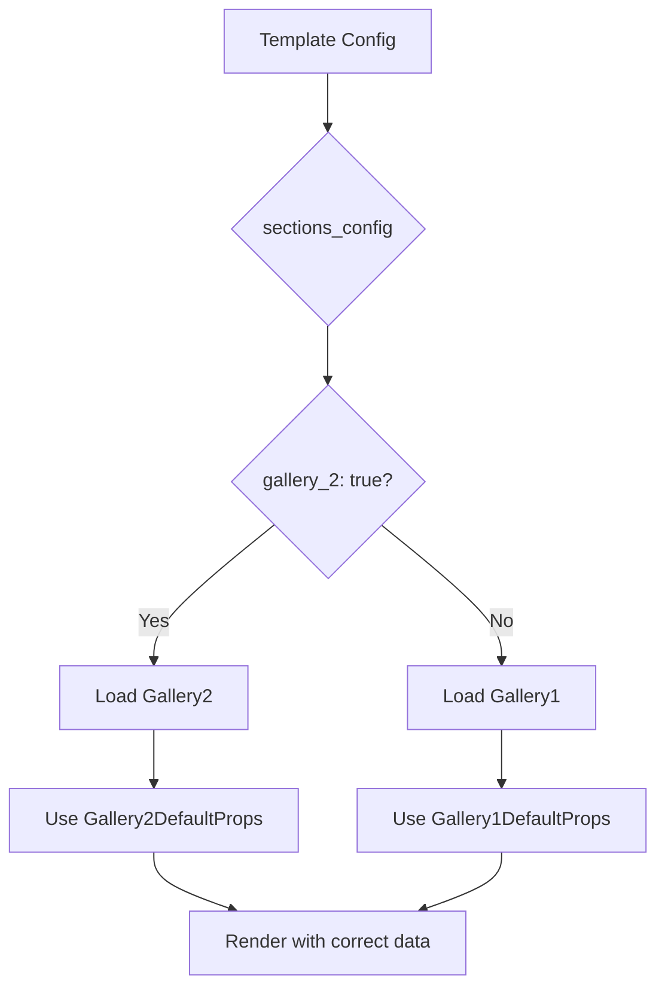
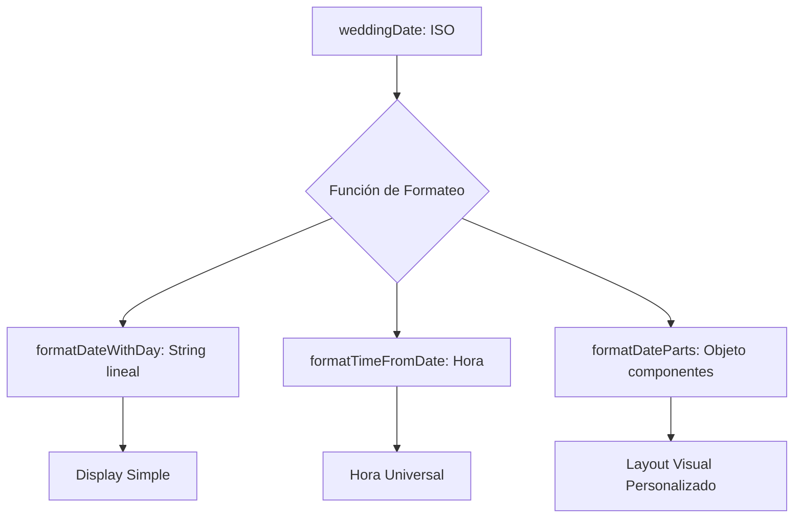

# 📋 GUÍA COMPLETA: Cómo Registrar Nuevas Secciones de Template

**Fecha:** 22 de Septiembre, 2025
**Propósito:** Documentar todas las ubicaciones donde se debe registrar una nueva sección para que funcione correctamente en el sistema

---

## 🎯 RESUMEN EJECUTIVO

Para que una nueva sección (como `Itinerary1`) funcione completamente en el sistema de templates, debe registrarse en **7 ubicaciones específicas**:

1. ✅ **Crear el componente** en la carpeta de secciones
2. ✅ **Configurar en customizer** (sectionFieldsMap)
3. ✅ **Integrar con hook** (useDynamicCustomizer)
4. ✅ **Validar en backend** (templates.py)
5. ✅ **Registrar en registry** (index.ts)
6. ✅ **Actualizar tipos TypeScript**
7. ✅ **Documentar cambios**

---

## 📁 UBICACIONES ESPECÍFICAS POR ARCHIVO

### 1. 🎨 **CREAR COMPONENTE DE SECCIÓN**

**Ubicación**: `frontend/src/components/templates/categories/[categoria]/sections/[nombre_seccion]/[Nombre]1.tsx`

**Ejemplo para Itinerary**:
```
frontend/src/components/templates/categories/weddings/sections/itinerary/Itinerary1.tsx
```

**Elementos Requeridos**:
- Interface de props
- Componente React funcional
- DefaultProps export
- Documentación JSDoc

**Ejemplo**:
```typescript
interface Itinerary1Props {
  title?: string;
  // ... otras props
}

export const Itinerary1: React.FC<Itinerary1Props> = ({
  title = 'Tu Itinerario'
}) => {
  // Implementación del componente
};

export const Itinerary1DefaultProps = {
  title: 'Tu Itinerario',
  // ... otros valores por defecto
};
```

---

### 2. ⚙️ **CONFIGURAR EN CUSTOMIZER**

**Ubicación**: `frontend/src/components/templates/categories/[categoria]/customizer/sectionFieldsMap.ts`

**Elementos a Agregar**:

#### A) Sección en WEDDING_SECTION_FIELDS_MAP:
```typescript
export const WEDDING_SECTION_FIELDS_MAP: Record<string, SectionConfig> = {
  // ... otras secciones

  itinerary: {
    label: 'Itinerario',
    icon: '📅',
    fields: [
      'itinerary_title',
      'itinerary_event_ceremonia_enabled',
      'itinerary_event_ceremonia_time',
      // ... otros campos
    ]
  },
};
```

#### B) Definiciones de Campos en FIELD_DEFINITIONS:
```typescript
export const FIELD_DEFINITIONS: Record<string, CustomizerField> = {
  // ... otros campos

  itinerary_title: {
    key: 'itinerary_title',
    label: 'Título del Itinerario',
    type: 'text',
    section: 'itinerary',
    category: 'Títulos'
  },

  itinerary_event_ceremonia_enabled: {
    key: 'itinerary_event_ceremonia_enabled',
    label: 'Mostrar Ceremonia',
    type: 'checkbox',
    section: 'itinerary',
    category: 'Eventos'
  },

  // ... más definiciones
};
```

---

### 3. 🔗 **INTEGRAR CON HOOK DE CUSTOMIZER**

**Ubicación**: `frontend/src/lib/hooks/useDynamicCustomizer.ts`

**Elementos a Agregar**:

#### A) Import de DefaultProps:
```typescript
import { Itinerary1DefaultProps } from '@/components/templates/categories/weddings/sections/itinerary/Itinerary1';
```

#### B) Casos en Switch Statement (useEffect):
```typescript
// Itinerary Section Defaults
case 'itinerary_title':
  defaultValue = templateProps.itinerary?.title || Itinerary1DefaultProps.title;
  break;
case 'itinerary_event_ceremonia_enabled':
  defaultValue = templateProps.itinerary?.event_ceremonia_enabled || Itinerary1DefaultProps.event_ceremonia_enabled;
  break;
// ... más casos
```

#### C) Sección en transformToTemplateProps:
```typescript
const transformToTemplateProps = useCallback((data: any) => {
  return {
    // ... otras secciones

    itinerary: {
      title: data.itinerary_title || Itinerary1DefaultProps.title,
      event_ceremonia_enabled: data.itinerary_event_ceremonia_enabled !== undefined ?
        data.itinerary_event_ceremonia_enabled : Itinerary1DefaultProps.event_ceremonia_enabled,
      // ... otros campos
    },
  };
}, []);
```

---

### 4. 🛡️ **VALIDAR EN BACKEND**

**Ubicación**: `backend/api/templates.py`

**Elemento a Modificar**:
```python
CATEGORY_SECTION_MAP = {
    'weddings': {
        'required': ['hero', 'welcome'],
        'optional': ['story', 'couple', 'video', 'gallery', 'countdown', 'itinerary', 'footer'],
        'forbidden': []
    },
    # ... otras categorías
}
```

**Ubicación**: Agregar 'itinerary' a la lista de secciones opcionales para la categoría correspondiente.

---

### 5. 📝 **REGISTRAR EN REGISTRY DE SECCIONES**

**Ubicación**: `frontend/src/components/templates/categories/[categoria]/sections/registry/index.ts`

**Elementos a Agregar**:

#### A) Import del Componente:
```typescript
// Import Wedding Itinerary Sections
import { Itinerary1 } from '../itinerary/Itinerary1';
```

#### B) Actualizar Interface WeddingSectionsByType:
```typescript
export interface WeddingSectionsByType {
  // ... otras secciones
  itinerary: { [key: string]: ComponentType<any> };
  footer: { [key: string]: ComponentType<any> };
}
```

#### C) Registrar en weddingSectionRegistry:
```typescript
export const weddingSectionRegistry: WeddingSectionRegistry = {
  // ... otras secciones

  // Itinerary Sections
  'itinerary_1': Itinerary1,

  // Footer Sections
  'footer_1': Footer1,
};
```

#### D) Agregar a weddingSectionsByType:
```typescript
export const weddingSectionsByType: WeddingSectionsByType = {
  // ... otras secciones

  itinerary: {
    'itinerary_1': Itinerary1,
    // 'itinerary_2': Itinerary2,
    // 'itinerary_3': Itinerary3,
  },

  footer: {
    'footer_1': Footer1,
  },
};
```

#### E) Actualizar WeddingTemplateConfig:
```typescript
export interface WeddingTemplateConfig {
  sections: {
    hero: string;
    welcome: string;
    couple: string;
    countdown: string;
    story: string;
    video: string;
    gallery: string;
    itinerary: string; // ✅ NUEVO
    footer: string;
  };
}
```

#### F) Actualizar Configuraciones de Ejemplo:
```typescript
export const exampleWeddingTemplateConfigs = {
  'elegante_romance': {
    sections: {
      hero: 'hero_1',
      welcome: 'welcome_1',
      couple: 'couple_1',
      countdown: 'countdown_1',
      story: 'story_1',
      video: 'video_1',
      gallery: 'gallery_1',
      itinerary: 'itinerary_1', // ✅ NUEVO
      footer: 'footer_1',
    }
  },
};
```

---

### 6. 📊 **ACTUALIZAR TIPOS TYPESCRIPT**

Las interfaces TypeScript se actualizan automáticamente al modificar los archivos anteriores, pero verificar:

- ✅ Props interface del componente
- ✅ WeddingSectionsByType interface
- ✅ WeddingTemplateConfig interface
- ✅ CustomizerField definitions

---

### 7. 📚 **DOCUMENTAR CAMBIOS**

**Archivos a Actualizar**:

#### A) ultima_modificacion.md:
- Fecha y descripción de cambios
- Lista de archivos modificados
- Funcionalidades implementadas
- URLs de testing

#### B) CLAUDE.md:
- Sección sobre la nueva funcionalidad
- Archivos afectados
- Características principales

#### C) README.md (opcional):
- Nuevas características en resumen ejecutivo

---

## ✅ CHECKLIST DE VERIFICACIÓN

### **Frontend Registration Checklist**:
- [ ] 1. Componente creado en `/sections/[nombre]/[Nombre]1.tsx`
- [ ] 2. Sección agregada a `WEDDING_SECTION_FIELDS_MAP`
- [ ] 3. Campos definidos en `FIELD_DEFINITIONS`
- [ ] 4. Import agregado en `useDynamicCustomizer.ts`
- [ ] 5. Casos agregados al switch statement
- [ ] 6. Sección agregada a `transformToTemplateProps`
- [ ] 7. Import agregado en `registry/index.ts`
- [ ] 8. Interface `WeddingSectionsByType` actualizada
- [ ] 9. Componente registrado en `weddingSectionRegistry`
- [ ] 10. Sección agregada a `weddingSectionsByType`
- [ ] 11. Interface `WeddingTemplateConfig` actualizada
- [ ] 12. Configuraciones de ejemplo actualizadas

### **Backend Validation Checklist**:
- [ ] 13. Sección agregada a `CATEGORY_SECTION_MAP` en `templates.py`

### **Documentation Checklist**:
- [ ] 14. Cambios documentados en `ultima_modificacion.md`
- [ ] 15. Información agregada a `CLAUDE.md`
- [ ] 16. Testing verificado

### **Testing Checklist**:
- [ ] 17. Componente se puede importar sin errores
- [ ] 18. Sección aparece en customizer
- [ ] 19. Campos son editables
- [ ] 20. Cambios se reflejan en preview
- [ ] 21. Validación backend funciona
- [ ] 22. Registry funciona correctamente

---

## 🚨 ERRORES COMUNES A EVITAR

### ❌ **Error 1: Olvidar el Registry**
- **Síntoma**: Sección no carga dinámicamente
- **Solución**: Verificar registro completo en `index.ts`

### ❌ **Error 2: Tipos TypeScript Inconsistentes**
- **Síntoma**: Errores de compilación
- **Solución**: Actualizar todas las interfaces

### ❌ **Error 3: Campos No Mapeados en Hook**
- **Síntoma**: Customizer no funciona
- **Solución**: Agregar casos al switch statement

### ❌ **Error 4: Validación Backend Faltante**
- **Síntoma**: Errores al guardar templates
- **Solución**: Agregar sección a `CATEGORY_SECTION_MAP`

### ❌ **Error 5: Props por Defecto Incorrectos**
- **Síntoma**: Componente no renderiza correctamente
- **Solución**: Verificar `DefaultProps` y `transformToTemplateProps`

---

## 🏁 RESULTADO FINAL

Siguiendo esta guía completa, cualquier nueva sección quedará:

✅ **Completamente funcional** en el sistema
✅ **Dinámicamente cargable** por el registry
✅ **Editable** en el customizer
✅ **Validada** por el backend
✅ **Documentada** para futuros desarrolladores
✅ **Integrada** con el sistema de types

---

## 📋 EJEMPLO COMPLETO: CASO ITINERARY

La sección Itinerary se implementó siguiendo exactamente estos pasos:

1. ✅ **Componente**: `Itinerary1.tsx` con timeline de eventos
2. ✅ **Customizer**: 11 campos (título + 5 eventos × 2 campos)
3. ✅ **Hook**: Integración completa con `useDynamicCustomizer`
4. ✅ **Backend**: Validación en categoría 'weddings'
5. ✅ **Registry**: Registro completo en `index.ts`
6. ✅ **Types**: Interfaces actualizadas
7. ✅ **Docs**: Documentación completa

**Resultado**: Nueva sección completamente operativa y lista para producción.

---

# 🔄 SECCIÓN ADICIONAL: Registro de Variantes de Secciones

**Actualizado:** 22 de Septiembre, 2025
**Nuevo Patrón:** Implementación de Variantes (Gallery1 vs Gallery2)

## 🎯 ¿QUÉ SON LAS VARIANTES DE SECCIONES?

Las **variantes de secciones** permiten tener múltiples versiones de una misma sección (ej: `gallery_1`, `gallery_2`) que:
- **Comparten los mismos campos** del customizer (evita duplicación)
- **Tienen diferentes presentaciones** visuales
- **Se detectan automáticamente** por el sistema
- **Son intercambiables** sin pérdida de datos

### **Ejemplo Implementado: Gallery1 vs Gallery2**
- **Gallery1**: Filtros por categorías, layout masonry
- **Gallery2**: Sin filtros, layout simple y responsive
- **Mismos datos**: Ambas usan las mismas 8 imágenes y campos
- **Diferente UX**: Presentación totalmente distinta

---

## 📋 PASOS ADICIONALES PARA VARIANTES

### **1. CREAR LA NUEVA VARIANTE**

Seguir los mismos pasos 1-7 de la guía principal, pero:

#### **Naming Convention:**
- **Primera variante**: `SectionName1.tsx` (ej: `Gallery1.tsx`)
- **Nueva variante**: `SectionName2.tsx` (ej: `Gallery2.tsx`)
- **Registry keys**: `section_1`, `section_2` (ej: `gallery_1`, `gallery_2`)

#### **Props Compatibility:**
```typescript
// ✅ CORRECTO: Mismas props, diferente presentación
interface Gallery1Props {
  sectionSubtitle?: string;
  sectionTitle?: string;
  galleryImages?: GalleryImage[];
}

interface Gallery2Props {
  sectionSubtitle?: string;     // ✅ Mismo nombre
  sectionTitle?: string;        // ✅ Mismo nombre
  galleryImages?: GalleryImage[]; // ✅ Misma estructura
}
```

#### **Registry Registration:**
```typescript
// En registry/index.ts
export const weddingSectionRegistry: WeddingSectionRegistry = {
  // Variantes de Gallery
  'gallery_1': Gallery1,
  'gallery_2': Gallery2, // ✅ AGREGAR NUEVA VARIANTE

  // Futuras variantes
  // 'gallery_3': Gallery3,
};

export const weddingSectionsByType: WeddingSectionsByType = {
  gallery: {
    'gallery_1': Gallery1,
    'gallery_2': Gallery2, // ✅ AGREGAR AQUÍ TAMBIÉN
  },
};
```

### **2. ACTUALIZAR SISTEMA DE DETECCIÓN**

#### **En useDynamicCustomizer.ts:**

```typescript
// ✅ Función de detección ya implementada
const getSectionVariant = useCallback((sectionType: string): string => {
  const configKeys = Object.keys(sectionsConfig);
  const sectionVariant = configKeys.find(key => key.startsWith(`${sectionType}_`));
  return sectionVariant || `${sectionType}_1`;
}, [sectionsConfig]);

// ✅ Agregar nueva variante al switch
switch (variant) {
  case 'gallery_1': return Gallery1DefaultProps;
  case 'gallery_2': return Gallery2DefaultProps; // ✅ NUEVA VARIANTE
  case 'gallery_3': return Gallery3DefaultProps; // ✅ FUTURAS VARIANTES
  // ...
}
```

#### **Switch Cases Dinámicos:**
```typescript
// ✅ Pattern para campos de variantes
case 'gallery_image_1_url': {
  const galleryDefaults = getSectionVariant('gallery') === 'gallery_2' ?
    Gallery2DefaultProps : Gallery1DefaultProps;
  defaultValue = templateProps.gallery?.galleryImages?.[0]?.url ||
                (galleryDefaults.galleryImages?.[0] as any)?.src ||
                (galleryDefaults.galleryImages?.[0] as any)?.url;
  break;
}
```

### **3. TRANSFORM PROPS INTELIGENTE**

```typescript
// ✅ En transformToTemplateProps
gallery: {
  sectionSubtitle: (getSectionVariant('gallery') === 'gallery_2' ?
    Gallery2DefaultProps : Gallery1DefaultProps).sectionSubtitle,
  sectionTitle: (getSectionVariant('gallery') === 'gallery_2' ?
    Gallery2DefaultProps : Gallery1DefaultProps).sectionTitle,
  // ... resto de campos
}
```

---

## ✅ CHECKLIST PARA VARIANTES

### **Checklist Básico (Pasos 1-7):**
- [ ] Componente creado con naming convention
- [ ] Props interface compatible
- [ ] DefaultProps exportados
- [ ] Registry actualizado (ambos objetos)
- [ ] Imports agregados
- [ ] TypeScript sin errores

### **Checklist Variantes Específico:**
- [ ] `getSectionVariant` maneja nueva variante
- [ ] Switch cases actualizados para nueva variante
- [ ] `transformToTemplateProps` actualizado
- [ ] Type casting aplicado si necesario (`as any`)
- [ ] Fallback safe implementado
- [ ] Testing de ambas variantes

---

## 🎨 CASOS DE USO PARA VARIANTES

### **Cuándo Crear Variantes:**
- ✅ **Layout Diferente**: Mismos datos, diferente presentación
- ✅ **UX Alternativa**: Experiencia simplificada vs completa
- ✅ **Responsive Needs**: Optimización para diferentes dispositivos
- ✅ **Client Preferences**: Opciones para diferentes gustos

### **Cuándo NO Crear Variantes:**
- ❌ **Datos Diferentes**: Si necesita campos diferentes, crear nueva sección
- ❌ **Funcionalidad Diferente**: Si comportamiento es totalmente distinto
- ❌ **Categoría Específica**: Si solo aplica a una categoría

---

## 🔧 PATRONES DE IMPLEMENTACIÓN

### **Pattern 1: Layout Variants (Gallery Example)**
```typescript
// Gallery1: Masonry + Filters
// Gallery2: Simple Grid + Navigation
// Same data, different presentation
```

### **Pattern 2: Complexity Variants**
```typescript
// Hero1: Full featured with video background
// Hero2: Simple with static image
// Same basic data, different complexity
```

### **Pattern 3: Device Optimization**
```typescript
// Welcome1: Desktop optimized
// Welcome2: Mobile-first design
// Same content, different optimization
```

---

## 🚨 ERRORES COMUNES CON VARIANTES

### **❌ Error 1: Props Incompatibles**
```typescript
// MAL: Diferentes interfaces
interface Gallery1Props { images?: Image[] }
interface Gallery2Props { photos?: Photo[] } // ❌ Diferente

// BIEN: Mismas interfaces
interface Gallery1Props { galleryImages?: GalleryImage[] }
interface Gallery2Props { galleryImages?: GalleryImage[] } // ✅ Igual
```

### **❌ Error 2: Nuevos Campos en Customizer**
```typescript
// MAL: Crear nuevos campos
'gallery2_special_field' // ❌ Duplicación

// BIEN: Reutilizar campos existentes
'gallery_image_1_url' // ✅ Reutilización
```

### **❌ Error 3: Type Safety Issues**
```typescript
// MAL: Acceso directo sin verificación
galleryDefaults.galleryImages[0].url // ❌ Puede fallar

// BIEN: Type casting seguro
(galleryDefaults.galleryImages?.[0] as any)?.url // ✅ Safe
```

---

## 📊 ARQUITECTURA DE VARIANTES

### **Flujo de Detección:**


### **Benefits del Sistema:**
- ✅ **No Duplication**: Reutiliza customizer fields
- ✅ **Type Safety**: Manejo seguro de variantes
- ✅ **Backward Compatible**: Variantes existentes siguen funcionando
- ✅ **Extensible**: Fácil agregar Gallery3, Gallery4, etc.
- ✅ **User Friendly**: Sin confusión en customizer

---

## 🎉 EJEMPLO COMPLETO: Gallery2

**Implementación exitosa que demuestra el patrón:**

### **Archivos Modificados:**
- ✅ `Gallery2.tsx` - Nuevo componente con misma interface
- ✅ `registry/index.ts` - Registro de variante
- ✅ `useDynamicCustomizer.ts` - Sistema de detección
- ✅ **0 nuevos campos** en customizer - Reutilización total

### **Resultado:**
- **Gallery1**: Filtros + Masonry (experiencia rica)
- **Gallery2**: Simple + Responsive (experiencia limpia)
- **Same Fields**: Ambas usan los mismos 24 campos
- **Different UX**: Presentación completamente distinta
- **Seamless Switching**: Cambio entre variantes sin pérdida de datos

---

---

# 🔧 SECCIÓN AVANZADA: Configuración de Campos por Variante

**Actualizado:** 23 de Septiembre, 2025
**Nuevo Sistema:** SECTION_VARIANTS_FIELDS - Campos específicos por variante

## 🎯 ¿QUÉ ES SECTION_VARIANTS_FIELDS?

El sistema **SECTION_VARIANTS_FIELDS** permite que cada variante de sección muestre solo los campos relevantes en el customizer, eliminando la confusión de campos no utilizados.

### **Problema Anterior:**
```typescript
// ❌ Welcome2 mostraba campos que no usaba
welcome_2: [
  'welcome_welcomeText',    // ❌ No usado en Welcome2
  'welcome_title',          // ❌ No usado en Welcome2
  'welcome_description',    // ✅ SÍ usado en Welcome2
  'welcome_couplePhotoUrl', // ❌ No usado en Welcome2
  'welcome_bannerImageUrl'  // ❌ No usado en Welcome2
]
```

### **Solución Actual:**
```typescript
// ✅ Welcome2 solo muestra el campo que realmente usa
export const SECTION_VARIANTS_FIELDS: Record<string, string[]> = {
  'welcome_1': [
    'welcome_welcomeText',
    'welcome_title',
    'welcome_description',
    'welcome_couplePhotoUrl',
    'welcome_bannerImageUrl'
  ],
  'welcome_2': [
    'welcome_description'  // Solo el campo que realmente renderiza
  ]
};
```

---

## 📋 IMPLEMENTACIÓN PASO A PASO

### **Paso 1: Agregar Configuración de Variante**

**Ubicación**: `frontend/src/components/templates/categories/weddings/customizer/sectionFieldsMap.ts`

```typescript
export const SECTION_VARIANTS_FIELDS: Record<string, string[]> = {
  // Hero Variants
  'hero_1': [
    'groom_name',
    'bride_name',
    'weddingDate',
    'eventLocation',
    'heroImageUrl'
  ],
  'hero_2': [
    'groom_name',
    'bride_name',
    'weddingDate',
    'eventLocation',
    'heroImageUrl'  // Mismos campos que hero_1
  ],

  // Welcome Variants
  'welcome_1': [
    'welcome_welcomeText',
    'welcome_title',
    'welcome_description',
    'welcome_couplePhotoUrl',
    'welcome_bannerImageUrl'
  ],
  'welcome_2': [
    'welcome_description'  // Solo descripción para diseño minimalista
  ],

  // Nuevas variantes se agregan aquí:
  // 'welcome_3': ['welcome_title', 'welcome_subtitle'],
  // 'hero_3': ['groom_name', 'bride_name', 'heroVideoUrl'],
};
```

### **Paso 2: Agregar Funciones Utilitarias**

**En el mismo archivo** (`sectionFieldsMap.ts`):

```typescript
/**
 * Get fields specific to a section variant (e.g., hero_1, welcome_2)
 */
export function getVariantSpecificFields(
  variantId: string,
  allFields: CustomizerField[]
): CustomizerField[] {
  const variantFields = SECTION_VARIANTS_FIELDS[variantId];

  if (!variantFields) {
    console.warn(`No variant fields configuration found for "${variantId}"`);
    return allFields;
  }

  return allFields.filter(field => variantFields.includes(field.key));
}

/**
 * Get available fields for sections considering their active variants
 */
export function getAvailableFieldsForVariant(
  activeSections: string[],
  sectionsConfig: Record<string, string>
): CustomizerField[] {
  const fieldsSet = new Set<string>();

  activeSections.forEach(sectionName => {
    const variantId = sectionsConfig[sectionName];

    if (variantId && SECTION_VARIANTS_FIELDS[variantId]) {
      const variantFields = SECTION_VARIANTS_FIELDS[variantId];
      variantFields.forEach(fieldKey => fieldsSet.add(fieldKey));
    } else {
      // Fallback to generic section fields
      const section = WEDDING_SECTION_FIELDS_MAP[sectionName];
      if (section) {
        section.fields.forEach(fieldKey => fieldsSet.add(fieldKey));
      }
    }
  });

  return Array.from(fieldsSet)
    .map(fieldKey => FIELD_DEFINITIONS[fieldKey])
    .filter(Boolean)
    .sort((a, b) => a.category.localeCompare(b.category));
}
```

### **Paso 3: Actualizar useDynamicCustomizer.ts**

**Ubicación**: `frontend/src/lib/hooks/useDynamicCustomizer.ts`

#### A) Agregar Import:
```typescript
import {
  getAvailableFields,
  getAvailableFieldsForVariant,  // ✅ NUEVO IMPORT
  WEDDING_SECTION_FIELDS_MAP as SECTION_FIELDS_MAP
} from '@/components/templates/categories/weddings/customizer/sectionFieldsMap';
```

#### B) Actualizar availableFields:
```typescript
// Get available fields based on active sections and their variants
const availableFields = useMemo(() => {
  // Use variant-specific field detection if sectionsConfig contains variant information
  if (sectionsConfig && Object.keys(sectionsConfig).length > 0) {
    console.log('🔧 Using variant-specific field detection');
    return getAvailableFieldsForVariant(activeSections, sectionsConfig);
  }

  // Fallback to generic section-based detection for legacy compatibility
  console.log('🔧 Using legacy section-based field detection');
  return getAvailableFields(activeSections);
}, [activeSections, sectionsConfig]);
```

---

## ✅ CHECKLIST PARA NUEVAS VARIANTES

### **Checklist Configuración de Campos:**
- [ ] Identificar campos realmente utilizados por la nueva variante
- [ ] Agregar entrada en `SECTION_VARIANTS_FIELDS` con campos específicos
- [ ] Verificar que existe fallback para secciones sin configuración
- [ ] Testing: Customizer muestra solo campos relevantes

### **Checklist Compatibilidad:**
- [ ] Variantes existentes siguen funcionando (no romper)
- [ ] Sistema fallback funciona para secciones sin configuración
- [ ] Import agregado en `useDynamicCustomizer.ts`
- [ ] Función `getAvailableFieldsForVariant` funciona correctamente

### **Checklist Testing:**
- [ ] Welcome1 muestra todos sus campos (5 campos)
- [ ] Welcome2 muestra solo descripción (1 campo)
- [ ] Hero1 y Hero2 muestran mismos campos (5 campos cada uno)
- [ ] No hay errores de console en browser
- [ ] Cambios en customizer se reflejan en preview

### **Testing Exhaustivo de Variantes:**

#### **1. Verificación de Base de Datos:**
```bash
# Verificar configuración en DB
cd backend
python -c "
from app import create_app
from models.template import Template
app = create_app()
with app.app_context():
    template = Template.query.get(TEMPLATE_ID)
    print('✅ sections_config:', template.sections_config)
    # Debe mostrar: {'welcome': 'welcome_2', ...}
"
```

#### **2. Verificación de Registry:**
```typescript
// En browser console de la página
console.log('✅ Registry welcome_2:', window.weddingSectionRegistry?.['welcome_2']);
console.log('✅ Registry welcome_1:', window.weddingSectionRegistry?.['welcome_1']);
// Ambos deben mostrar funciones de componente
```

#### **3. Verificación de DefaultProps:**
```typescript
// En browser console
import { Welcome2DefaultProps } from '@/components/templates/categories/weddings/sections/welcome/Welcome2';
console.log('✅ Welcome2 description:', Welcome2DefaultProps.description);
// Debe mostrar: "TU SIEMPRE SERAS MI REFERENTE..."
```

#### **4. Verificación de Logs de Sistema:**
Con los logs agregados, abrir DevTools Console y recargar. Buscar:
```
🔍 getSectionVariant called: { sectionType: "welcome", sectionsConfig: {...} }
🔍 Found variant for welcome: welcome_2
🎯 Final variant result: welcome_2
✅ Using Welcome2DefaultProps: TU SIEMPRE SERAS MI REFERENTE...
```

#### **5. Test de Render Correcto:**
- [ ] La página muestra el texto de Welcome2DefaultProps
- [ ] Customizer muestra solo 1 campo para welcome_2
- [ ] No aparecen textos de Welcome1 en la página
- [ ] Console no muestra fallbacks o warnings ⚠️

---

## 🎨 EJEMPLOS DE CONFIGURACIÓN

### **Caso 1: Variante Minimalista (Welcome2)**
```typescript
'welcome_2': [
  'welcome_description'  // Solo el mensaje principal
]
```
**Uso**: Diseño limpio que solo muestra el mensaje de amor.

### **Caso 2: Variantes con Mismos Campos (Hero1 vs Hero2)**
```typescript
'hero_1': ['groom_name', 'bride_name', 'weddingDate', 'eventLocation', 'heroImageUrl'],
'hero_2': ['groom_name', 'bride_name', 'weddingDate', 'eventLocation', 'heroImageUrl']
```
**Uso**: Diferentes diseños visuales pero mismos datos de entrada.

### **Caso 3: Variante Extendida (Futuro Welcome3)**
```typescript
'welcome_3': [
  'welcome_title',
  'welcome_subtitle',
  'welcome_backgroundVideo',
  'welcome_overlayOpacity'
]
```
**Uso**: Versión avanzada con video de fondo y nuevos campos específicos.

---

## 🚨 ERRORES COMUNES Y TROUBLESHOOTING

### **🔧 TROUBLESHOOTING: Variante No Se Carga Correctamente**

**Síntomas:**
- La variante muestra contenido de otra variante (ej: Welcome2 muestra texto de Welcome1)
- Console logs muestran que se detecta la variante correcta pero se renderiza otra
- Base de datos tiene configuración correcta pero frontend usa fallback

**Causa Más Común: Error en getSectionVariant Logic**
```typescript
// ❌ INCORRECTO: Busca claves que empiecen con el tipo
const sectionVariant = configKeys.find(key => key.startsWith(`${sectionType}_`));

// ✅ CORRECTO: Busca el valor de la clave del tipo
const sectionVariant = sectionsConfig[sectionType];
```

**Explicación del Error:**
```json
// En sections_config de la base de datos:
{
  "welcome": "welcome_2",  // ← Clave: "welcome", Valor: "welcome_2"
  "hero": "hero_1"
}

// Lógica INCORRECTA busca claves que empiecen con "welcome_":
// configKeys = ["welcome", "hero"]
// configKeys.find(key => key.startsWith("welcome_")) = undefined ❌

// Lógica CORRECTA busca directamente el valor:
// sectionsConfig["welcome"] = "welcome_2" ✅
```

**Checklist de Diagnóstico:**
- [ ] Verificar `sections_config` en base de datos tiene formato correcto
- [ ] Agregar console logs en `getSectionVariant()`
- [ ] Confirmar que `sectionsConfig` llega al hook
- [ ] Verificar que registry tiene la variante registrada
- [ ] Revisar que DefaultProps están exportados correctamente

**Scripts de Debugging:**

1. **Verificar Base de Datos:**
```python
# backend/debug_template.py
from app import create_app
from models.template import Template

app = create_app()
with app.app_context():
    template = Template.query.get(TEMPLATE_ID)
    print(f'Sections Config: {template.sections_config}')
```

2. **Logs en getSectionVariant:**
```typescript
const getSectionVariant = useCallback((sectionType: string): string => {
  console.log('🔍 getSectionVariant:', { sectionType, sectionsConfig });

  if (!sectionsConfig) {
    console.log('❌ No sectionsConfig');
    return `${sectionType}_1`;
  }

  const sectionVariant = sectionsConfig[sectionType];
  console.log('🎯 Result:', sectionVariant || `${sectionType}_1`);

  return sectionVariant || `${sectionType}_1`;
}, [sectionsConfig]);
```

3. **Verificar Registry:**
```typescript
// En browser console
console.log(window.weddingSectionRegistry?.['welcome_2']);
// Debería mostrar el componente Welcome2
```

### **❌ Error 1: Listar Campos No Utilizados**
```typescript
// MAL: Welcome2 lista campos que no renderiza
'welcome_2': [
  'welcome_welcomeText',    // ❌ No usado en Welcome2
  'welcome_description',    // ✅ SÍ usado
  'welcome_couplePhotoUrl'  // ❌ No usado en Welcome2
]

// BIEN: Solo campos realmente utilizados
'welcome_2': [
  'welcome_description'  // ✅ Solo lo que realmente renderiza
]
```

### **❌ Error 2: No Agregar Fallback**
```typescript
// MAL: Sin validación
const variantFields = SECTION_VARIANTS_FIELDS[variantId];
return allFields.filter(field => variantFields.includes(field.key));

// BIEN: Con fallback seguro
const variantFields = SECTION_VARIANTS_FIELDS[variantId];
if (!variantFields) {
  console.warn(`No variant fields configuration found for "${variantId}"`);
  return allFields;  // ✅ Fallback seguro
}
```

### **❌ Error 3: Lógica Incorrecta en getSectionVariant**
```typescript
// MAL: Buscar en las claves del objeto
const sectionVariant = Object.keys(sectionsConfig).find(key =>
  key.startsWith(`${sectionType}_`)
);

// BIEN: Acceder directamente al valor
const sectionVariant = sectionsConfig[sectionType];
```

**Por qué falla:**
```json
// sectionsConfig desde DB:
{"welcome": "welcome_2", "hero": "hero_1"}

// Método INCORRECTO:
// Object.keys(sectionsConfig) = ["welcome", "hero"]
// key.startsWith("welcome_") = false (porque "welcome" ≠ "welcome_")
// Resultado: undefined → usa fallback welcome_1 ❌

// Método CORRECTO:
// sectionsConfig["welcome"] = "welcome_2"
// Resultado: "welcome_2" ✅
```

### **❌ Error 4: Olvidar Update useDynamicCustomizer**
```typescript
// MAL: Solo usar función antigua
const availableFields = useMemo(() => {
  return getAvailableFields(activeSections);  // ❌ No considera variantes
}, [activeSections]);

// BIEN: Usar función variant-aware
const availableFields = useMemo(() => {
  if (sectionsConfig && Object.keys(sectionsConfig).length > 0) {
    return getAvailableFieldsForVariant(activeSections, sectionsConfig);  // ✅ Considera variantes
  }
  return getAvailableFields(activeSections);  // ✅ Fallback legacy
}, [activeSections, sectionsConfig]);
```

---

## 📊 BENEFICIOS DEL SISTEMA

### **✅ User Experience Mejorada:**
- **Welcome1**: Muestra 5 campos relevantes
- **Welcome2**: Muestra 1 campo relevante (no confunde con campos no usados)
- **Customizer más limpio**: Solo opciones aplicables

### **✅ Developer Experience Mejorada:**
- **Escalabilidad**: Agregar nuevas variantes es trivial
- **Mantenimiento**: Cada variante controla sus propios campos
- **Debugging**: Logs claros sobre qué función se está usando

### **✅ Arquitectura Robusta:**
- **Backward Compatible**: Secciones sin configuración usan fallback
- **Type Safe**: Funciones tipadas correctamente
- **Performance**: Solo carga campos necesarios

---

## 🏁 RESULTADO FINAL

**Con SECTION_VARIANTS_FIELDS implementado:**

### **Antes (Configuración Global):**
```
Welcome1: 5 campos (todos relevantes) ✅
Welcome2: 5 campos (4 irrelevantes) ❌
```

### **Después (Configuración por Variante):**
```
Welcome1: 5 campos (todos relevantes) ✅
Welcome2: 1 campo (100% relevante) ✅
```

### **Escalabilidad Futura:**
```typescript
// Fácil agregar nuevas variantes
'welcome_3': ['welcome_title', 'welcome_videoUrl'],
'welcome_4': ['welcome_description', 'welcome_animation'],
'hero_3': ['groom_name', 'bride_name', 'hero_particles_enabled']
```

---

---

# 🛡️ MEJORES PRÁCTICAS PARA EVITAR BUGS

## 🔍 **SIEMPRE VERIFICAR ANTES DE IMPLEMENTAR**

### **1. Entender la Estructura de Datos:**
```json
// ✅ CORRECTO: Entender que sections_config es clave-valor
{
  "welcome": "welcome_2",  // Clave: tipo, Valor: variante
  "hero": "hero_1"
}

// ❌ INCORRECTO: Asumir que es array de strings
["welcome_2", "hero_1"]
```

### **2. Testing Inmediato después de Cambios:**
```bash
# Después de cada modificación importante:
1. Verificar DB: python debug_template.py
2. Abrir browser console y verificar logs
3. Confirmar que texto correcto aparece en pantalla
4. Probar customizer fields
```

### **3. Logs Defensivos:**
```typescript
// ✅ AGREGAR LOGS SIEMPRE en funciones críticas
const getSectionVariant = (sectionType: string) => {
  console.log('Debug:', { sectionType, sectionsConfig });
  // ... lógica
  console.log('Result:', result);
  return result;
};
```

### **4. Validación de Datos:**
```typescript
// ✅ SIEMPRE validar que los datos existen
if (!sectionsConfig) {
  console.warn('Missing sectionsConfig');
  return fallback;
}

if (!sectionsConfig[sectionType]) {
  console.warn(`No config for ${sectionType}`);
  return fallback;
}
```

## 🚨 **RED FLAGS - Señales de Que Algo Está Mal**

### **⚠️ Señales en Console:**
- `⚠️ Fallback to Welcome1DefaultProps` (cuando esperabas Welcome2)
- `❌ No sectionsConfig` (configuración no llegó)
- `undefined` en logs de variantes
- Warnings sobre campos faltantes

### **⚠️ Señales en UI:**
- Variante muestra contenido de otra variante
- Customizer muestra campos incorrectos
- Texto default no corresponde con el componente
- Registry errors en console

### **⚠️ Señales en Backend:**
- `sections_config` es `null` o estructura incorrecta
- Template no tiene `template_type: 'modular'`
- Errores de serialización JSON

## 💡 **DEBUGGING WORKFLOW RECOMENDADO**

### **Paso 1: Verificar Base de Datos**
```python
template = Template.query.get(ID)
print(f'Type: {template.template_type}')  # Debe ser 'modular'
print(f'Config: {template.sections_config}')  # Debe tener la variante
```

### **Paso 2: Verificar Frontend Recibe Datos**
```typescript
// En useDynamicCustomizer
console.log('Received sectionsConfig:', sectionsConfig);
```

### **Paso 3: Verificar Lógica de Detección**
```typescript
// En getSectionVariant
console.log('Detection result:', sectionsConfig[sectionType]);
```

### **Paso 4: Verificar Registry**
```typescript
// En browser console
console.log(window.weddingSectionRegistry?.['welcome_2']);
```

### **Paso 5: Verificar DefaultProps**
```typescript
console.log(Welcome2DefaultProps.description);
```

---

---

# 🎨 SECCIÓN AVANZADA: Sistema de Formateo de Fechas y Layouts Visuales

**Actualizado:** 23 de Septiembre, 2025
**Caso de uso:** PlaceReligioso1 - Layout visual separado para fechas

## 🎯 ¿QUÉ ES EL SISTEMA DE FORMATEO DE FECHAS?

El sistema de formateo de fechas proporciona utilidades flexibles para mostrar fechas en diferentes formatos visuales, desde texto lineal hasta layouts complejos separados por componentes.

### **Funciones Disponibles:**

#### **1. formatDateWithDay() - Formato Lineal**
```typescript
// Input: "2024-11-16T17:00:00"
// Output: "SÁBADO 16 NOVIEMBRE 2024"
export function formatDateWithDay(dateString: string): string
```

#### **2. formatTimeFromDate() - Extracción de Hora**
```typescript
// Input: "2024-11-16T17:00:00"
// Output: "5:00 PM"
export function formatTimeFromDate(dateString: string): string
```

#### **3. formatDateParts() - Componentes Separados**
```typescript
// Input: "2024-11-16T17:00:00"
// Output: { dayName: "SÁBADO", day: 16, monthName: "NOVIEMBRE", year: 2024 }
export function formatDateParts(dateString: string): {
  dayName: string;
  day: number;
  monthName: string;
  year: number;
}
```

---

## 🎨 CASOS DE USO: Layouts Visuales

### **Caso 1: Layout Lineal (Hero, Footer, Countdown)**
```jsx
const formattedDate = formatDateWithDay(weddingDate);
// Resultado: "SÁBADO 16 NOVIEMBRE 2024"

<p>{formattedDate}</p>
```

### **Caso 2: Layout Visual Separado (PlaceReligioso)**
```jsx
const dateParts = formatDateParts(weddingDate);
const formattedTime = formatTimeFromDate(weddingDate);

// Layout visual con jerarquía:
<div className="flex items-center justify-center gap-4">
  <span className="text-lg">{dateParts.dayName}</span>     // SÁBADO
  <span className="text-4xl font-bold">{dateParts.day}</span> // 16 (destacado)
  <span className="text-lg">{dateParts.monthName}</span>   // NOVIEMBRE
</div>
<div className="text-center">
  <span className="text-2xl">{dateParts.year}</span>       // 2024
</div>
<p>{formattedTime}</p>                                     // 5:00 PM
```

---

## 📋 IMPLEMENTACIÓN: PlaceReligioso1 como Referencia

### **Problema Resuelto:**
- **Antes**: Fecha lineal simple "SÁBADO 16 NOVIEMBRE 2024"
- **Después**: Layout visual destacado con número prominente

### **Implementación Completa:**

#### **1. Importar Funciones:**
```typescript
import { formatDateParts, formatTimeFromDate } from '@/lib/utils/dateFormatter';
```

#### **2. Usar en Componente:**
```typescript
export const PlaceReligioso1: React.FC<PlaceReligioso1Props> = ({
  weddingDate = PlaceReligioso1DefaultProps.weddingDate,
  // ... otras props
}) => {
  const dateParts = formatDateParts(weddingDate);
  const formattedTime = formatTimeFromDate(weddingDate);

  return (
    <section>
      <div className="text-center mb-6">
        {/* Primera fila: DÍA + NÚMERO + MES */}
        <div className="flex items-center justify-center gap-3 md:gap-4 mb-2 flex-wrap">
          <span className="text-lg md:text-xl font-montserrat text-gray-700">
            {dateParts.dayName}
          </span>
          <span className="text-4xl md:text-5xl font-montserrat font-bold text-gray-800 px-2">
            {dateParts.day}
          </span>
          <span className="text-lg md:text-xl font-montserrat text-gray-700">
            {dateParts.monthName}
          </span>
        </div>

        {/* Segunda fila: AÑO */}
        <div className="text-center mb-3">
          <span className="text-2xl md:text-3xl font-montserrat font-semibold text-gray-800">
            {dateParts.year}
          </span>
        </div>

        {/* Hora */}
        <p className="text-xl md:text-2xl font-montserrat text-gray-700">
          {formattedTime}
        </p>
      </div>
    </section>
  );
};
```

### **3. Responsive Design Considerations:**
```css
/* Desktop: Layout horizontal */
.flex.items-center.justify-center.gap-4

/* Mobile: Permite wrap si no cabe */
.flex-wrap

/* Spacing responsive */
.gap-3.md:gap-4

/* Typography responsive */
.text-lg.md:text-xl        // Día y mes
.text-4xl.md:text-5xl      // Número destacado
.text-2xl.md:text-3xl      // Año
```

---

## 🎯 MEJORES PRÁCTICAS: Formateo de Fechas

### **✅ Cuándo Usar Cada Función:**

#### **formatDateWithDay():**
- Secciones simples (Hero, Footer, Countdown)
- Espacios limitados
- Texto corrido o párrafos

#### **formatTimeFromDate():**
- Siempre para extraer hora de weddingDate
- Evita campos duplicados (ubicacion_hora → eliminado)
- Mantiene sincronización automática

#### **formatDateParts():**
- Layouts visuales complejos
- Cuando necesitas jerarquía visual
- Destacar elementos específicos (números, días especiales)
- Designs creativos con fecha separada

### **✅ Patrón de Campos Compartidos:**
```typescript
// ✅ CORRECTO: Un solo campo para fecha + hora
interface SectionProps {
  weddingDate?: string;  // "2024-11-16T17:00:00"
  // NO crear: fecha_especifica, hora_especifica
}

// En componente:
const dateParts = formatDateParts(weddingDate);     // Para fecha
const formattedTime = formatTimeFromDate(weddingDate); // Para hora
```

### **❌ Antipatrones a Evitar:**
```typescript
// ❌ MAL: Campos separados duplicados
interface BadSectionProps {
  section_fecha?: string;    // Duplicación innecesaria
  section_hora?: string;     // Puede desincronizarse
  weddingDate?: string;      // Campo original ignorado
}
```

---

## 🎨 CASOS DE USO FUTUROS

### **Posibles Variantes de Formateo:**

#### **1. Layout Calendario (DatePicker Style):**
```jsx
<div className="calendar-style">
  <div className="month-year">{dateParts.monthName} {dateParts.year}</div>
  <div className="day-number">{dateParts.day}</div>
  <div className="day-name">{dateParts.dayName}</div>
</div>
```

#### **2. Layout Countdown Visual:**
```jsx
<div className="countdown-grid">
  <div className="time-unit">
    <span className="number">{dateParts.day}</span>
    <span className="label">días</span>
  </div>
  <div className="time-unit">
    <span className="number">{dateParts.year}</span>
    <span className="label">año</span>
  </div>
</div>
```

#### **3. Layout Timeline:**
```jsx
<div className="timeline-date">
  <div className="timeline-marker">{dateParts.day}</div>
  <div className="timeline-content">
    <h3>{dateParts.dayName}</h3>
    <p>{dateParts.monthName} {dateParts.year}</p>
  </div>
</div>
```

---

## 📊 ARQUITECTURA: Sistema de Fechas

### **Flujo de Datos:**


### **Beneficios del Sistema:**
- ✅ **Reutilización**: Mismas funciones para múltiples secciones
- ✅ **Consistencia**: Formato español estándar
- ✅ **Flexibilidad**: Desde simple hasta layouts complejos
- ✅ **Mantenibilidad**: Cambios centralizados en dateFormatter.ts
- ✅ **Type Safety**: TypeScript interfaces claras

---

## ✅ CHECKLIST: Implementación de Fechas Visuales

### **Planning:**
- [ ] Identificar el tipo de layout requerido (lineal vs visual)
- [ ] Determinar jerarquía visual (qué elementos destacar)
- [ ] Considerar responsive behavior

### **Implementation:**
- [ ] Importar función apropiada desde dateFormatter.ts
- [ ] Implementar layout con clases Tailwind responsivas
- [ ] Usar weddingDate como campo compartido (no crear campos específicos)
- [ ] Probar en desktop y mobile

### **Testing:**
- [ ] Verificar formato correcto en español
- [ ] Confirmar responsive behavior
- [ ] Validar jerarquía visual (elementos destacados)
- [ ] Testing con diferentes fechas (meses largos, días especiales)

---

**🏆 ACHIEVEMENT: Advanced Section Architecture + Visual Date Formatting System**
- ✅ **Variant System**: Arquitectura escalable implementada
- ✅ **Zero Duplication**: Máxima eficiencia de código
- ✅ **Type Safety**: Sistema robusto y seguro
- ✅ **Future Ready**: Base para infinitas variantes
- ✅ **Variant-Specific Fields**: Customizer inteligente implementado
- ✅ **Bug Prevention**: Guía completa de troubleshooting y mejores prácticas
- ✅ **Production Ready**: Testing exhaustivo y debugging tools
- ✅ **Visual Date Formatting**: Sistema flexible para layouts de fechas complejos
- ✅ **Shared Fields Pattern**: Reutilización de weddingDate sin duplicación

---

**Desarrollado por**: Claude Code (Sistema de Templates)
**Status**: 🎉 **GUÍA COMPLETA DE REGISTRO DE SECCIONES + VARIANTES + FIELDS CONFIGURATION + TROUBLESHOOTING + VISUAL DATE SYSTEMS + 3D CAROUSELS**
**Achievement**: Complete Registration Guide + Variant Architecture + Advanced Fields System + Best Practices + Bug Prevention + Visual Date Formatting + 3D Interactive Carousels
**Para**: Futuros desarrolladores que implementen nuevas secciones, variantes, sistemas de formateo visual y componentes 3D interactivos